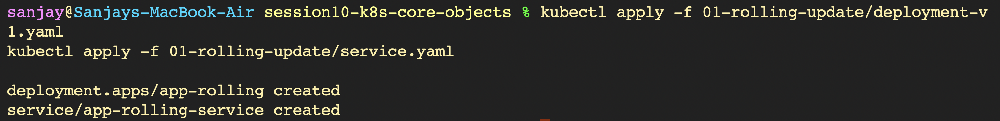
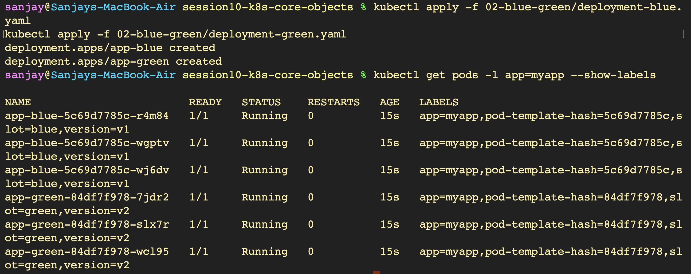
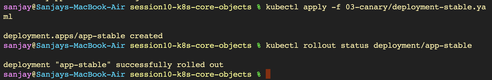
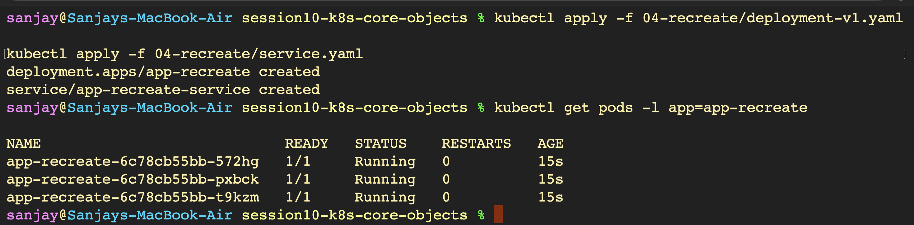

# Kubernetes Deployment Strategies - Hands-on Lab

---

## Strategy 1: Rolling Update (`Images-01`)

### 1. Deploying Version 1 Application & Service

### 2. Verifying Rollout Status

### 3. Verifying Pods & Version Labels

### 4. Exposing the Service via Minikube

### 5. Accessing Version 1 in Browser

### 6. Triggering Rolling Update to Version 2

### 7. Real-Time Pod Replacement Watch

### 8. Verifying Version 2 Rollout Completion

### 9. Rollout History & Instant Rollback

---

## Strategy 2: Blue-Green Deployment (`Images02`)

### 1. Deploying Blue (v1) and Green (v2) Concurrently

### 2. Pointing Service to Blue (v1 LIVE)

### 3. Browser Verification of Blue Environment

### 4. Confirming Service Selector & Endpoints for Blue

### 5. Instant Switchover to Green (v2)

### 6. Browser Verification of Green Environment

### 7. Confirming Green Service Selector

### 8. Instant Rollback to Blue

---

## Strategy 3: Canary Deployment (`Images03`)

### 1. Deploying Stable Baseline (9 Pods = 90% Traffic)

### 2. Deploying Canary (1 Pod = 10% Traffic)

### 3. Scaling Canary Traffic to 30%

### 4. Promoting Canary to 100%

### 5. Cleanup / Decommissioning Stable

---

## Strategy 4: Recreate Deployment (`Images04`)

### 1. Deploying Version 1 Application & Service

### 2. Triggering Recreate Update & Watching Pods

### 3. Downtime Window Verification (Zero Running Pods)

### 4. Outage Observation via Continuous Curl

### 5. Rollback Demonstration

