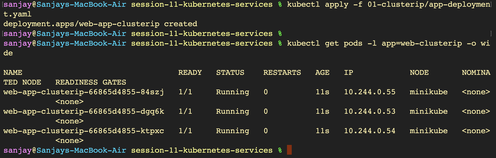
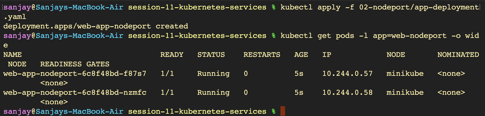
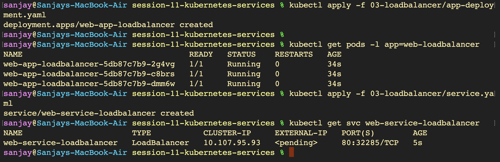
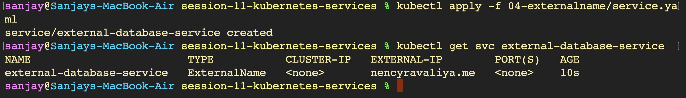
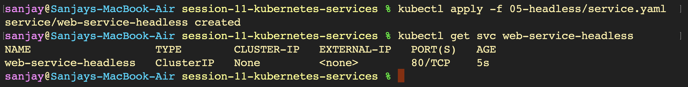

# Kubernetes Service Types - Hands-on Lab

---

## Service 1: ClusterIP Service (`Images01`)

### 1. Deploying Backend Web Application

### 2. Deploying the ClusterIP Service

### 3. Inspecting Service Endpoints

### 4. Deploying Test Curl Client Pod

### 5. Testing Internal Service DNS Resolution

### 6. Testing Full FQDN Resolution

### 7. Port Forwarding for Local Access

### 8. Browser Verification via Port Forward

---

## Service 2: NodePort Service (`Images02`)

### 1. Deploying Backend Web Application

### 2. Deploying NodePort Service

### 3. Identifying Node IP Address

### 4. Creating Minikube Service Tunnel

### 5. Browser Verification via NodePort

---

## Service 3: LoadBalancer Service (`Images03`)

### 1. Deploying Application & LoadBalancer Service

### 2. Provisioning External IP via Minikube Tunnel

### 3. Exposing and Accessing LoadBalancer URL

### 4. Browser Verification via LoadBalancer

---

## Service 4: ExternalName Service (`Images04`)

### 1. Deploying ExternalName Service

### 2. Deploying DNS Test Client Pod

### 3. Verifying CNAME DNS Resolution

### 4. Testing HTTP Connection to External Service

---

## Service 5: Headless Service (`Images05`)

### 1. Deploying Headless Service

### 2. Deploying StatefulSet with Predictable Identities

### 3. Deploying Headless DNS Client Pod

### 4. Verifying Multiple Direct Pod IPs in DNS Lookup

### 5. Accessing Individual Pod via Predictable DNS Record

