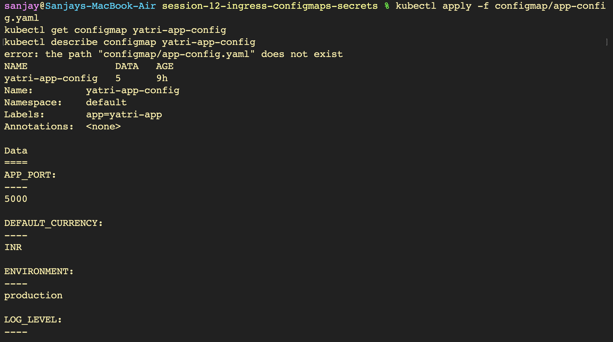
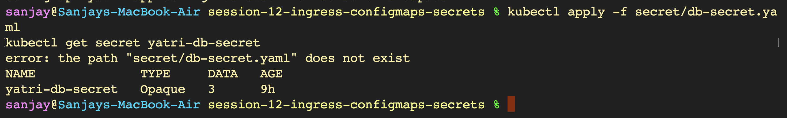
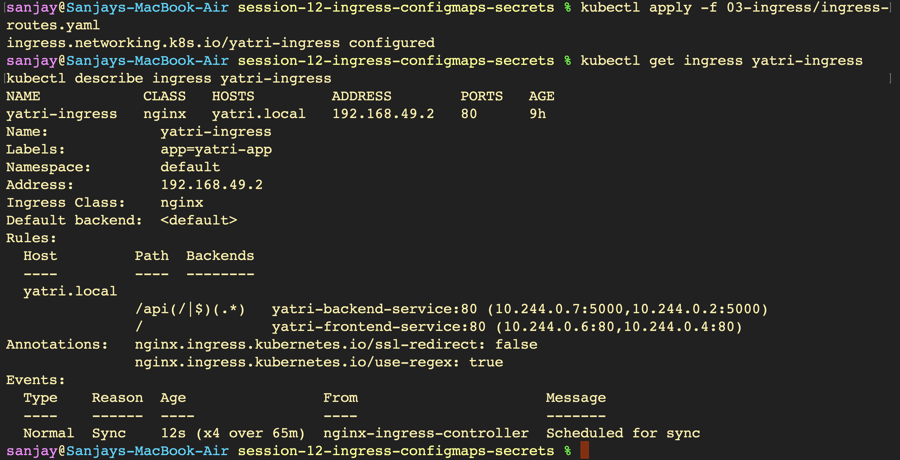
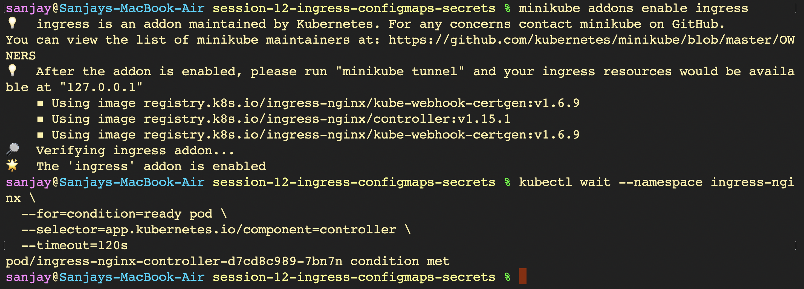

# Kubernetes Ingress, ConfigMaps, and Secrets - Hands-on Lab

---

## Part 1: ConfigMaps — Decoupling Plain-Text Configuration (`Images01`)

### 1. Creating and Inspecting ConfigMap

### 2. Viewing Remaining ConfigMap Data

### 3. Reading ConfigMap Value Directly via JSONPath

---

## Part 2: Secrets — Protecting Sensitive Credentials (`Images02`)

### 1. Inspecting Opaque Secret

### 2. Decoding Secret Value for Validation

---

## Part 3: Ingress — L7 Traffic Routing & TLS Termination (`Images03`)

### 1. Path-Based Ingress Configuration

### 2. Generating Self-Signed TLS Certificate

### 3. Creating Kubernetes TLS Secret

### 4. Verifying TLS Secret Creation

### 5. Applying Multi-Host Ingress with TLS

### 6. Testing Host-Based Routing and TLS via Curl

---

## Part 4: Full Microservices Integration Demo (`Images04`)

### 1. Enabling Ingress Controller Addon on Minikube

### 2. Creating Application ConfigMap

### 3. Inspecting Injected Configuration Parameters

### 4. Creating Database Secret

### 5. Deploying Frontend Microservice

### 6. Deploying Backend API Microservice

### 7. Verifying Backend Rollout Status

### 8. Applying Ingress Routing Rules

### 9. Mapping Local Domain in Hosts File

### 10. Verifying Hosts File Configuration

### 11. Testing End-to-End API and Injected Environment Variables

