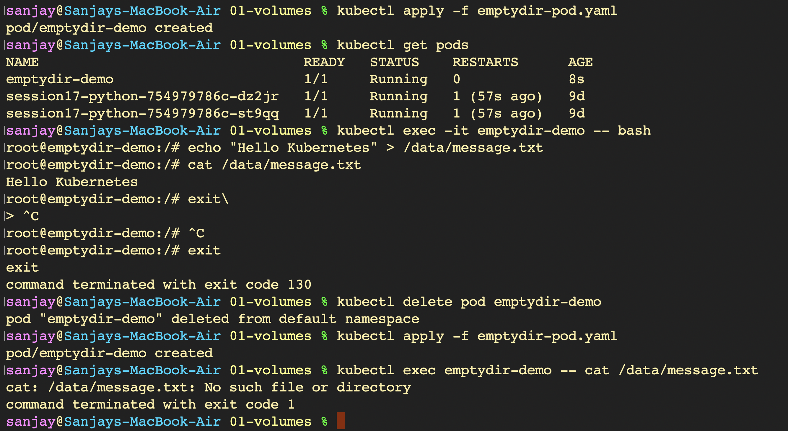
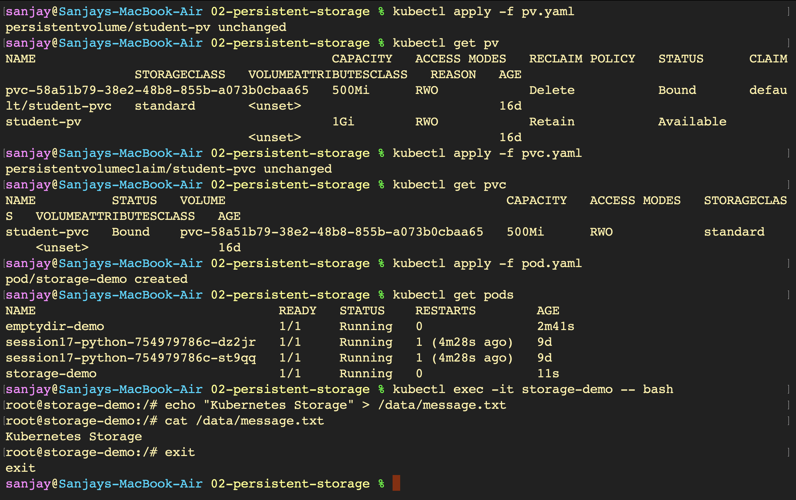
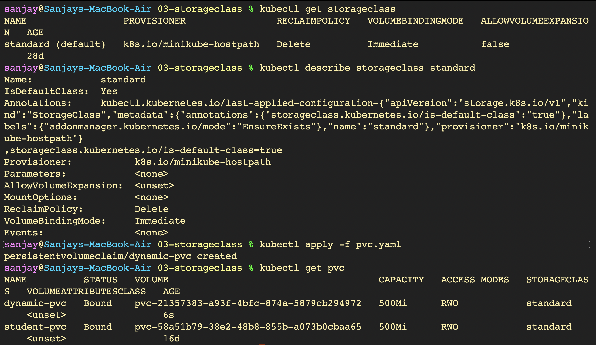
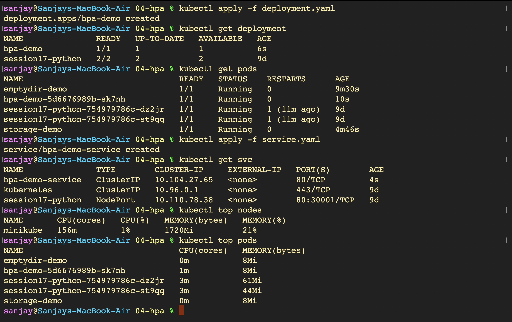
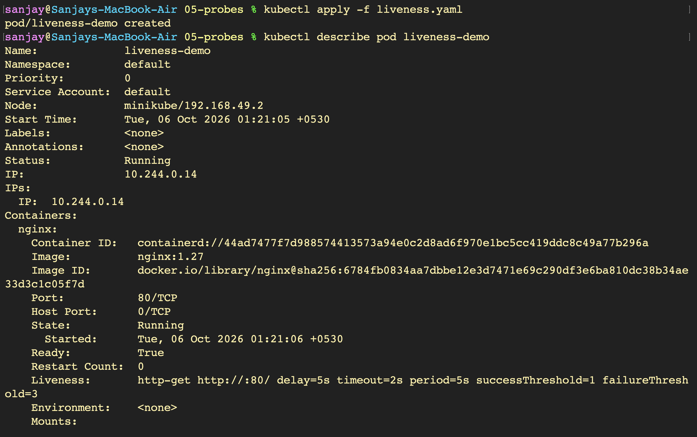
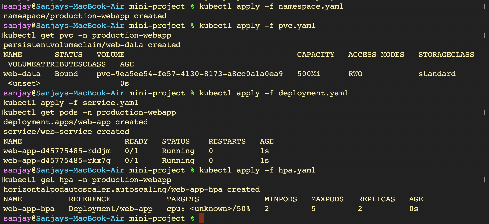

# Kubernetes Storage, HPA, and Health Probes - Hands-on Lab

A comprehensive hands-on guide covering Kubernetes volume management (`emptyDir`), persistent storage (`PersistentVolume`, `PersistentVolumeClaim`), dynamic storage provisioning with `StorageClass`, elastic autoscaling using `HorizontalPodAutoscaler` (`metrics-server`), container health diagnostics (`Startup`, `Readiness`, and `Liveness` probes), and a production-grade microservice mini-project integrating all core pillars.

---

## Part 1: Kubernetes Volumes — Ephemeral Storage & Lifecycle

### 1. Deploying `emptyDir` Pod, Writing Data, and Verifying Ephemeral Lifecycle
```bash
kubectl apply -f emptydir-pod.yaml
kubectl get pods
kubectl exec -it emptydir-demo -- bash
echo "Hello Kubernetes" > /data/message.txt
cat /data/message.txt
exit

# Demonstrate ephemeral storage loss upon Pod recreation
kubectl delete pod emptydir-demo
kubectl apply -f emptydir-pod.yaml
kubectl exec emptydir-demo -- cat /data/message.txt
```


---

## Part 2: Persistent Storage — Static PV and PVC Binding

### 1. Provisioning PersistentVolume (PV), PersistentVolumeClaim (PVC), and Storage Pod
```bash
kubectl apply -f pv.yaml
kubectl get pv
kubectl apply -f pvc.yaml
kubectl get pvc
kubectl apply -f pod.yaml
kubectl get pods
kubectl exec -it storage-demo -- bash
echo "Kubernetes Storage" > /data/message.txt
cat /data/message.txt
exit
```


### 2. Deleting Pod and Verifying Data Persistence Across Pod Re-creation
```bash
kubectl delete pod storage-demo
kubectl apply -f pod.yaml
kubectl exec storage-demo -- cat /data/message.txt
```


---

## Part 3: StorageClass — Dynamic Volume Provisioning

### 1. Inspecting Default StorageClass and Requesting Dynamic Storage via PVC
```bash
kubectl get storageclass
kubectl describe storageclass standard
kubectl apply -f pvc.yaml
kubectl get pvc
```


### 2. Verifying Dynamically Provisioned PersistentVolume Bound to PVC
```bash
kubectl get pv
kubectl get storageclass
```


---

## Part 4: Horizontal Pod Autoscaler (HPA) — Elastic Autoscaling

### 1. Deploying Workload Application & Exposing Service
```bash
kubectl apply -f deployment.yaml
kubectl get deployment
kubectl get pods
kubectl apply -f service.yaml
kubectl get svc
kubectl top nodes
kubectl top pods
```


### 2. Enabling Metrics-Server Addon & Verifying Resource Metrics
```bash
minikube addons enable metrics-server
kubectl get pods -n kube-system
kubectl top pods
```


### 3. Deploying HPA and Generating Traffic Spike with Load Generator
```bash
kubectl apply -f hpa.yaml
kubectl get hpa
kubectl run load-generator \
  --image=busybox:1.36 \
  --restart=Never \
  -- /bin/sh -c \
  "while true; do wget -q -O- http://hpa-demo-service; done"
kubectl get hpa -w
```


### 4. Real-Time Workload Pod Scale-Up Monitoring
```bash
kubectl get pods -w
```


### 5. Deleting Load Generator and Verifying Autoscaler Stabilization
```bash
kubectl delete pod load-generator
kubectl get hpa -w
```


---

## Part 5: Health Probes — Startup, Readiness, & Liveness Diagnostics

### 1. Deploying Pod with Liveness Probe and Inspecting Diagnostics
```bash
kubectl apply -f liveness.yaml
kubectl describe pod liveness-demo
```


### 2. Deploying Readiness Probe, Exposing Service, and Verifying Endpoints
```bash
kubectl apply -f readiness.yaml
kubectl expose pod readiness-demo \
  --name=readiness-service \
  --port=80
kubectl get endpoints readiness-service
kubectl apply -f startup.yaml
```


### 3. Inspecting Multi-Probe Pod Configuration (Startup, Readiness, Liveness)
```bash
kubectl describe pod startup-demo
```


### 4. Inspecting Invalid Readiness Probe Configuration (`/wrongpath`)
```yaml
apiVersion: v1
kind: Pod
metadata:
  name: readiness-demo
  labels:
    app: readiness-demo
spec:
  containers:
  - name: nginx
    image: nginx:1.27
    ports:
    - containerPort: 80
    readinessProbe:
      httpGet:
        path: /wrongpath
        port: 80
      initialDelaySeconds: 5
      periodSeconds: 5
```


### 5. Attempting In-Place Update and Inspecting Probe Enforcement
```bash
kubectl apply -f readiness.yaml
kubectl get pod readiness-demo
```


### 6. Testing Liveness Probe Modification and Watching Container Restarts
```bash
kubectl apply -f liveness.yaml
kubectl get pod liveness-demo -w
```


### 7. Comprehensive Diagnostic Audit of Container State and Probe Events
```bash
kubectl describe pod liveness-demo
```


---

## Part 6: Mini-Project — Production Web App with Storage, Probes, & HPA

### 1. Deploying Production Stack in Dedicated Namespace (`production-webapp`)
```bash
kubectl apply -f namespace.yaml
kubectl apply -f pvc.yaml
kubectl get pvc -n production-webapp
kubectl apply -f deployment.yaml
kubectl apply -f service.yaml
kubectl get pods -n production-webapp
kubectl apply -f hpa.yaml
kubectl get hpa -n production-webapp
```


### 2. Verifying Persistent Storage Across Pod Lifecycle and Setting Port-Forwarding
```bash
# Identify running pod and write data to persistent mount
POD_NAME=$(kubectl get pods -n production-webapp -l app=web-app -o jsonpath='{.items[0].metadata.name}')
kubectl exec -n production-webapp "$POD_NAME" -- sh -c 'echo "Student: Jane Doe" > /data/student.txt'
echo $POD_NAME
kubectl exec -n production-webapp "$POD_NAME" -- cat /data/student.txt

# Terminate Pod to test persistence across replica rescheduling
kubectl delete pod -n production-webapp "$POD_NAME"
NEW_POD=$(kubectl get pods -n production-webapp -l app=web-app -o jsonpath='{.items[0].metadata.name}')
kubectl exec -n production-webapp "$NEW_POD" -- cat /data/student.txt

# Port forward application service for local browser testing
kubectl port-forward -n production-webapp svc/web-service 8080:80
```


### 3. Verifying Application Health & Browser Reachability via Port-Forward
```bash
# Browser navigation to local forwarded port
http://localhost:8080
```


### 4. Triggering Traffic Surge with Load Generator and Verifying Elastic HPA Scaling
```bash
kubectl run load-generator -n production-webapp \
  --image=busybox:1.36 \
  --restart=Never \
  -- /bin/sh -c "while true; do wget -q -O- http://web-service; done"
kubectl get hpa -n production-webapp
```

