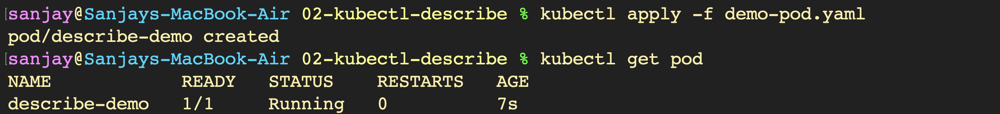
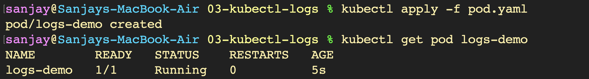
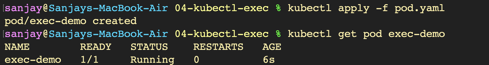
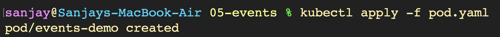
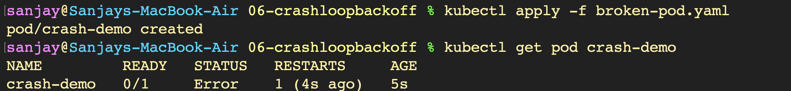
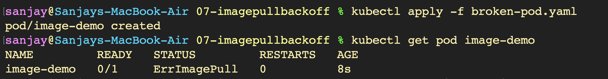
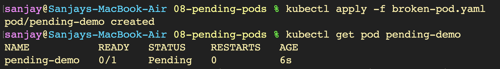
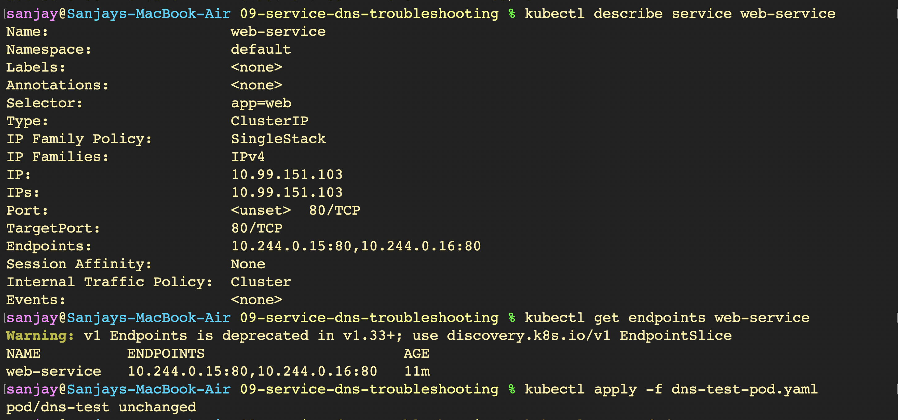

# Kubernetes Troubleshooting - Hands-on Lab

A comprehensive hands-on troubleshooting guide covering core Kubernetes debugging tools (`kubectl get`, `kubectl describe`, `kubectl logs`, `kubectl exec`, `events`) and resolving common workload failures (`CrashLoopBackOff`, `ImagePullBackOff`, `Pending Pods`, and `Service & DNS routing issues`).

---

## Part 1: `kubectl get` — Inspecting Cluster State & Workloads (`Images01`)

### 1. Creating Sample Workload Pod and Checking Initial Pod Status
```bash
kubectl apply -f sample-workload.yaml
kubectl get pods
```


### 2. Inspecting Pods with Detailed Information (`-o wide`) and Listing Services
```bash
kubectl get pods -o wide
kubectl get services
```


### 3. Inspecting Deployments, Cluster Nodes, and All Namespace Resources
```bash
kubectl get deployments
kubectl get nodes
kubectl get all
```


### 4. Watching Pods in Real-Time (`-w`), Deleting Pod, and Verifying Cleanup
```bash
kubectl get pods -w
kubectl delete pod get-demo
kubectl get pods
```


---

## Part 2: `kubectl describe` — Detailed Pod Inspection & Diagnostics (`Images02`)

### 1. Deploying Demo Pod and Checking Status
```bash
kubectl apply -f demo-pod.yaml
kubectl get pod
```


### 2. Inspecting Pod Details, Container State, IP, and Conditions
```bash
kubectl describe pod describe-demo
```


### 3. Verifying Pod Execution Environment and Container Specs
```bash
kubectl describe pod describe-demo
```


---

## Part 3: `kubectl logs` — Application Logging & Streaming (`Images03`)

### 1. Deploying Logging Demo Pod and Verifying Status
```bash
kubectl apply -f pod.yaml
kubectl get pod logs-demo
```


### 2. Inspecting Application Logs and Streaming Live Output (`-f`)
```bash
kubectl logs logs-demo
kubectl logs -f logs-demo
```


---

## Part 4: `kubectl exec` — Interactive Diagnostics & In-Container Inspection (`Images04`)

### 1. Deploying Execution Target Pod and Checking Status
```bash
kubectl apply -f pod.yaml
kubectl get pod exec-demo
```


### 2. Interactive Bash Shell and Filesystem Verification
```bash
kubectl exec -it exec-demo -- bash
ls
ls /usr/share/nginx/html
```


### 3. Testing Nginx Configuration Syntax Directly Inside Container
```bash
nginx -T
```


### 4. Executing Non-Interactive Commands Directly in Container
```bash
kubectl exec exec-demo -- hostname
```


---

## Part 5: Kubernetes Events — Cluster Activity & Scheduling Audit (`Images05`)

### 1. Deploying Events Demo Pod
```bash
kubectl apply -f pod.yaml
```


### 2. Inspecting Cluster-Wide Events
```bash
kubectl get events
```


### 3. Chronological Event Sorting by Timestamp
```bash
kubectl get events --sort-by=.lastTimestamp
```


### 4. Inspecting Pod Configuration and Events via Pod Describe
```bash
kubectl describe pod events-demo
```


### 5. Filtering Targeted Events for Specific Pod
```bash
kubectl events --for pod/events-demo
```


---

## Part 6: Troubleshooting `CrashLoopBackOff` (`Images06`)

### 1. Deploying Broken Pod and Observing Container Exit Error
```bash
kubectl apply -f broken-pod.yaml
kubectl get pod crash-demo
```


### 2. Inspecting Container Terminated State and Non-Zero Exit Code
```bash
kubectl describe pod crash-demo
```


### 3. Investigating Crash Logs via Standard and Previous Log Inspection
```bash
kubectl logs crash-demo
kubectl logs crash-demo --previous
```


### 4. Deleting Broken Workload and Applying Fixed Manifest
```bash
kubectl delete pod crash-demo
kubectl apply -f fixed-pod.yaml
```


### 5. Verifying Fixed Pod Running State and Healthy Logs
```bash
kubectl get pod crash-demo
kubectl logs crash-demo
```


---

## Part 7: Troubleshooting `ImagePullBackOff` (`Images07`)

### 1. Deploying Pod with Non-Existent Image and Observing Pull Failure
```bash
kubectl apply -f broken-pod.yaml
kubectl get pod image-demo
```


### 2. Inspecting Waiting State and `ImagePullBackOff` Reason
```bash
kubectl describe pod image-demo
```


### 3. Diagnosing Image Pull Failure via Events Section
```bash
kubectl describe pod image-demo
```


### 4. Deleting Broken Pod and Deploying Fixed Manifest
```bash
kubectl delete pod image-demo
kubectl apply -f fixed-pod.yaml
```


### 5. Verifying Successful Image Pull and Running State
```bash
kubectl get pod image-demo
```


---

## Part 8: Troubleshooting `Pending` Pods (`Images08`)

### 1. Deploying Pod with Unschedulable Node Selector
```bash
kubectl apply -f broken-pod.yaml
kubectl get pod pending-demo
```


### 2. Diagnosing Scheduling Failure and Node Selector Mismatch via Describe
```bash
kubectl describe pod pending-demo
```


### 3. Inspecting Cluster Nodes and Deleting Pending Pod
```bash
kubectl get nodes
kubectl delete pod pending-demo
```


### 4. Applying Fixed Manifest and Verifying Successful Pod Scheduling
```bash
kubectl apply -f fixed-pod.yaml
kubectl get pod pending-demo
```


---

## Part 9: Service & DNS Troubleshooting (`Images09`)

### 1. Deploying Application, Inspecting Pod Labels, and Exposing Service
```bash
kubectl apply -f deployment.yaml
kubectl get pods --show-labels
kubectl apply -f service.yaml
kubectl get service
```


### 2. Verifying Service Selector, TargetPort, and Registered Endpoints
```bash
kubectl describe service web-service
kubectl get endpoints web-service
```


### 3. Deploying and Verifying Running DNS Test Client Pod
```bash
kubectl apply -f dns-test-pod.yaml
kubectl get pod dns-test
```


### 4. Testing Internal Service DNS Resolution via FQDN
```bash
kubectl exec -it dns-test -- nslookup web-service.default.svc.cluster.local
```


### 5. Verifying HTTP Web Reachability through Service Name
```bash
kubectl exec dns-test -- wget -qO- http://web-service
```


### 6. Diagnosing Broken Service with Mismatched Selectors and Missing Endpoints
```bash
kubectl apply -f broken-service.yaml
kubectl get endpoints broken-service
```

