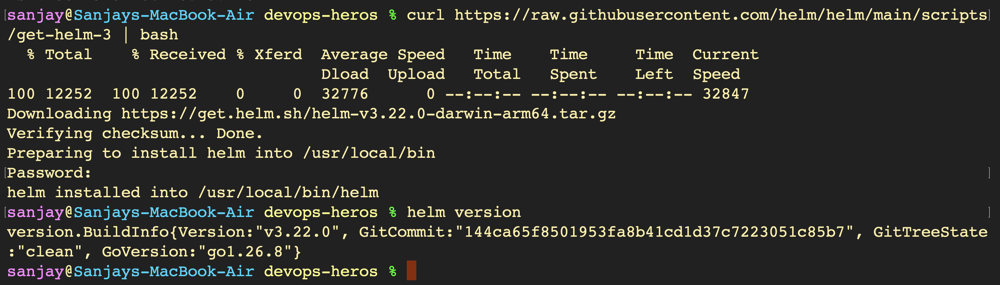
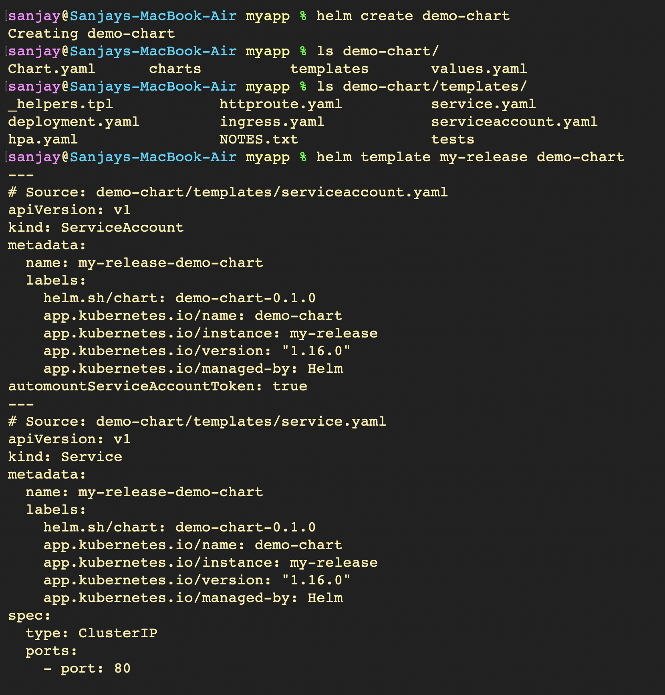
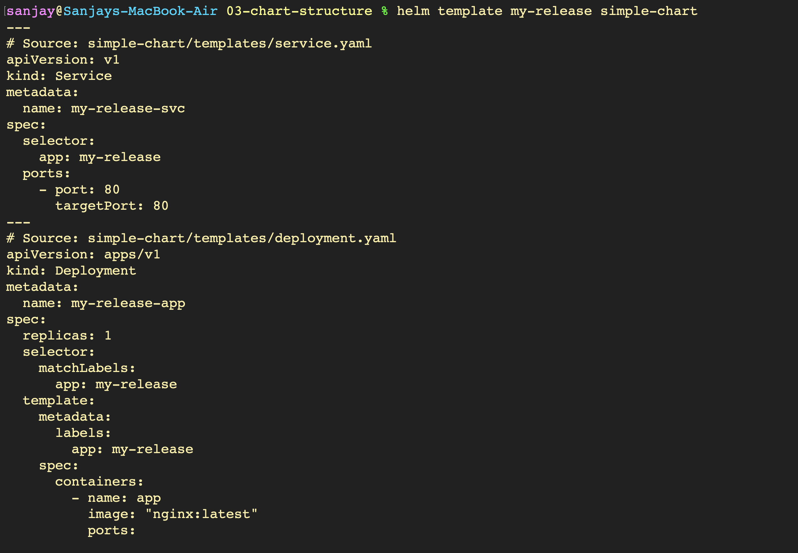
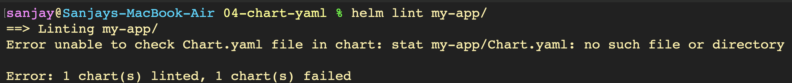
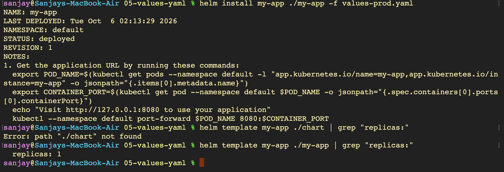
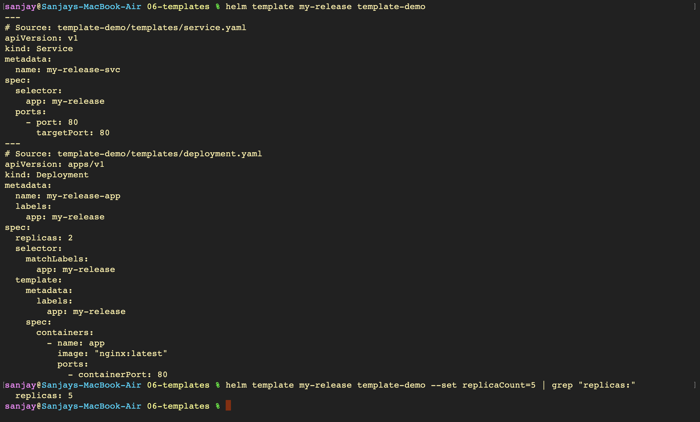
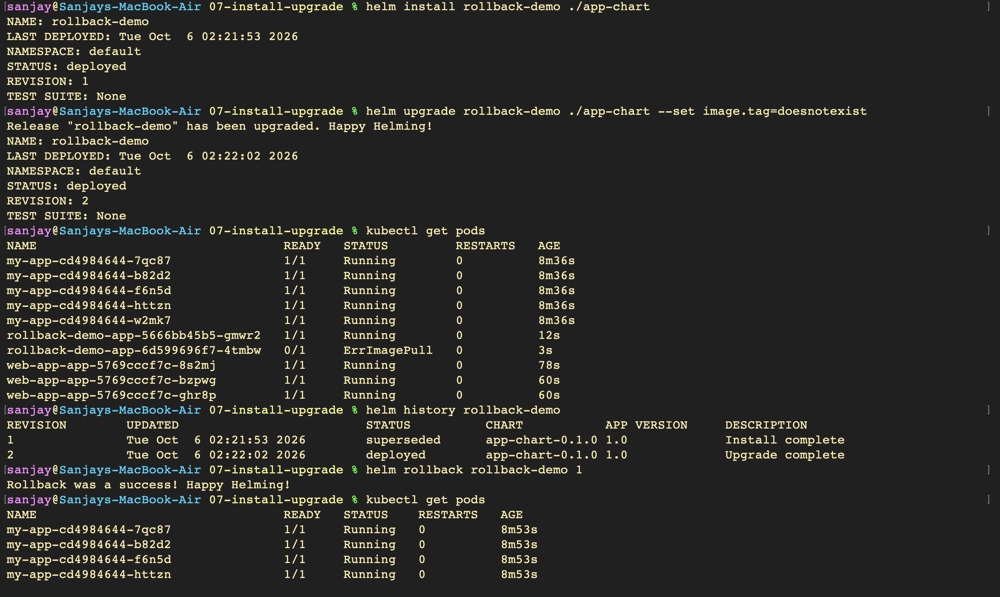
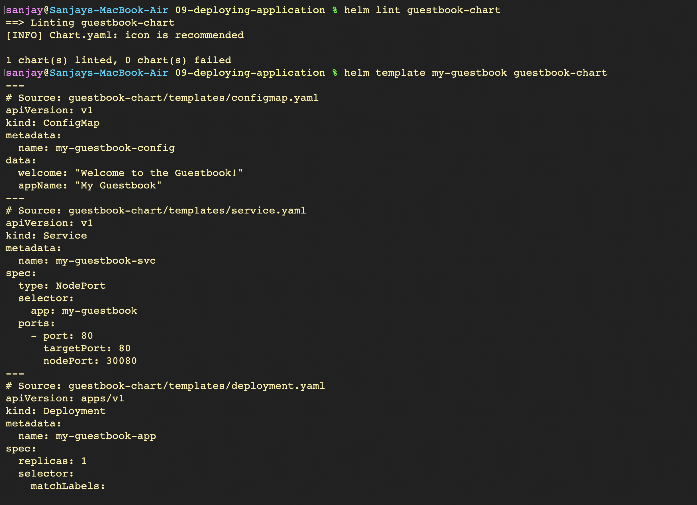
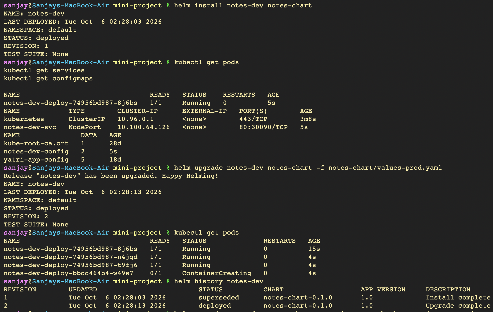

# Kubernetes Package Management with Helm - Hands-on Lab

A comprehensive hands-on guide covering Helm package management for Kubernetes: installing Helm CLI, managing chart repositories, exploring chart structure and Go template syntax, managing configuration through `values.yaml` and CLI overrides, executing release lifecycles (`install`, `upgrade`, `history`, `rollback`, and `--atomic` safeguards), deploying a full guestbook microservice, and completing an end-to-end production Helm mini-project.

---

## Part 1: Helm Fundamentals & Repository Management

### 1. Installing Helm CLI and Verifying Version
```bash
curl https://raw.githubusercontent.com/helm/helm/main/scripts/get-helm-3 | bash
helm version
```


### 2. Adding Bitnami Chart Repository and Deploying Nginx Release
```bash
helm list
helm repo add bitnami https://charts.bitnami.com/bitnami
helm repo update
helm install my-nginx bitnami/nginx
```


### 3. Inspecting Helm-Managed Kubernetes Pods and Services
```bash
kubectl get pods
kubectl get services
```


---

## Part 2: Helm Charts & Local Release Lifecycle

### 1. Scaffolding a New Chart and Inspecting Structure & Templates
```bash
helm create demo-chart
ls demo-chart/
ls demo-chart/templates/
helm template my-release demo-chart
```


### 2. Installing Release, Inspecting Active Releases, and Uninstalling
```bash
helm install demo-release demo-chart
kubectl get pods
helm list
helm uninstall demo-release
```


---

## Part 3: Chart Anatomy & Template Rendering

### 1. Rendering Chart Templates Locally via `helm template`
```bash
helm template my-release simple-chart
```


### 2. Deploying Simple Chart, Verifying Workload Resources, and Cleanup
```bash
helm install my-release simple-chart
kubectl get pods
kubectl get services
helm uninstall my-release
```


---

## Part 4: Chart Syntax Validation with `helm lint`

### 1. Linting Chart and Catching Missing Manifest Errors
```bash
helm lint my-app/
```


---

## Part 5: Values & Parameter Overrides

### 1. Deploying Chart with Environment Values File (`values-prod.yaml`)
```bash
helm install my-app ./my-app -f values-prod.yaml
helm template my-app ./my-app | grep "replicas:"
```


### 2. Dynamically Overriding Values via `--set` CLI Flag
```bash
helm template my-app ./my-app --set replicaCount=3 | grep "replicas:"
```


---

## Part 6: Go Template Syntax & Conditionals

### 1. Inspecting Interpolated Manifests and Verifying Dynamic Substitution
```bash
helm template my-release template-demo
helm template my-release template-demo --set replicaCount=5 | grep "replicas:"
```


---

## Part 7: Release Upgrades & Scaling

### 1. Deploying Release and Performing In-Place Upgrades
```bash
helm install web-app ./app-chart
kubectl get pods
helm list
helm upgrade web-app ./app-chart --set replicaCount=3
kubectl get pods
```


---

## Part 8: Rollbacks & Atomic Deployments

### 1. Simulating Broken Image Deployment, Checking History, and Manual Rollback
```bash
helm install rollback-demo ./app-chart
helm upgrade rollback-demo ./app-chart --set image.tag=doesnotexist
kubectl get pods
helm history rollback-demo
helm rollback rollback-demo 1
kubectl get pods
```


### 2. Automated Safe Deployments with `--atomic` and Rollback History Audit
```bash
helm history rollback-demo
helm upgrade rollback-demo ./app-chart \
  --set image.tag=doesnotexist \
  --atomic \
  --timeout 60s
helm uninstall rollback-demo
```


---

## Part 9: Full Application Lifecycle Deployment

### 1. Linting and Dry-Run Manifest Rendering for Guestbook Application
```bash
helm lint guestbook-chart
helm template my-guestbook guestbook-chart
```


### 2. Deploying Guestbook, Scaling Workload, History Inspection, and Rollback
```bash
helm install my-guestbook guestbook-chart
kubectl get pods
kubectl get services
kubectl get configmaps
helm upgrade my-guestbook guestbook-chart --set replicaCount=3
kubectl get pods
helm history my-guestbook
helm rollback my-guestbook 1
```


---

## Part 10: Mini-Project — Notes App Production Helm Deployment

### 1. Validating Notes Chart Syntax and Inspecting Rendered Output
```bash
helm lint notes-chart
helm template notes-dev notes-chart
```


### 2. Deploying Initial Release and Upgrading to Production Configuration
```bash
helm install notes-dev notes-chart
kubectl get pods
kubectl get services
kubectl get configmaps
helm upgrade notes-dev notes-chart -f notes-chart/values-prod.yaml
kubectl get pods
helm history notes-dev
```


### 3. Simulating Failed Upgrade, Rolling Back to Healthy Revision, and Resource Cleanup
```bash
# Attempt upgrade with invalid non-existent image tag
helm upgrade notes-dev notes-chart --set image.tag=broken-tag-does-not-exist
kubectl get pods

# Rollback to stable Revision 2
helm rollback notes-dev 2
kubectl get pods

# Clean up release and verify full resource deletion
helm uninstall notes-dev
kubectl get pods
kubectl get services
```

