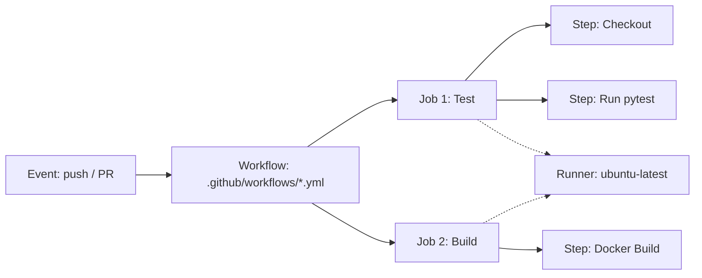
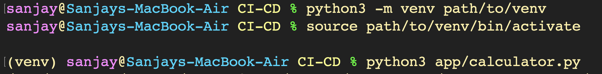

# CI/CD Pipelines with GitHub Actions - Hands-on Lab & Comprehensive Guide

A comprehensive hands-on guide covering Continuous Integration and Continuous Deployment (CI/CD) workflows with GitHub Actions: exploring foundational CI/CD theories, pipeline architecture, GitHub Actions workflow primitives (workflows, jobs, steps, runners, secrets, and artifacts), local Python development and testing with `pytest` and `pytest-cov`, containerization using Docker, Kubernetes deployments with Minikube, and implementing an automated multi-stage GitHub Actions CI/CD pipeline.

---

## Conceptual Architecture: CI vs CD

```mermaid
flowchart TD
    subgraph Developer Laptop
        DEV[Developer Code] -->|git commit| GIT[Local Git]
    end

    subgraph Continuous Integration (CI)
        GIT -->|git push| GHR[GitHub Repository]
        GHR --> GHA[GitHub Actions Trigger]
        GHA --> LINT[Code Linting & Formatting]
        LINT --> TEST[Automated Unit Tests]
        TEST --> COV[Code Coverage Analysis]
        COV --> BUILD[Package Build & Artifact Creation]
    end

    subgraph Continuous Delivery / Deployment (CD)
        BUILD --> CONT[Docker Image Build]
        CONT --> SCAN[Security & Vulnerability Scan]
        SCAN --> REG[Container Registry Publish]
        REG --> DEPLOY{Deployment Mode}
        DEPLOY -->|Manual Approval| CDEL[Continuous Delivery]
        DEPLOY -->|Automatic Promotion| CDEP[Continuous Deployment]
        CDEL --> K8S[Kubernetes Cluster]
        CDEP --> K8S
    end
```

### 1. Continuous Integration (CI)
- **Definition**: The software engineering practice where developers frequently merge code updates into a shared central repository. Every push triggers an automated build and test pipeline.
- **Primary Goal**: Detect bugs early, prevent integration drift, reduce debugging overhead, and ensure master branch stability.
- **Key Stages**: Code checkout, dependency installation, static linting, unit testing, test coverage verification, and build artifact creation.

### 2. Continuous Delivery (CD) vs Continuous Deployment (CD)
- **Continuous Delivery**: Automatically builds, tests, and stages every validated code change into a deployable artifact or staging environment. The release to production requires a manual one-click sign-off or release schedule.
- **Continuous Deployment**: Fully automates the entire journey from git commit to live production rollout with zero human gatekeeping, relying on automated smoke tests, canary rollouts, and automatic rollbacks.

### 3. CI vs CD Comparison

| Dimension | Continuous Integration (CI) | Continuous Delivery (CD) | Continuous Deployment (CD) |
| :--- | :--- | :--- | :--- |
| **Focus** | Code validation & merging | Software release preparation | Automated production release |
| **Trigger** | Every commit / pull request | Passing CI pipeline | Passing Delivery pipeline |
| **Output** | Tested build artifacts | Deploy-ready package / Staging | Live production deployment |
| **Human Gate** | Automated | Manual approval to production | Zero human intervention |
| **Target Audience** | Software Developers | QA, Release Managers, DevOps | End Users & Customers |

---

## GitHub Actions Core Concepts

GitHub Actions is an event-driven automation platform built directly into GitHub. It is composed of five core building blocks:



1. **Workflows**: Configurable automated processes defined in YAML files located in `.github/workflows/`. They define which events trigger execution and which jobs to run.
2. **Events**: Specific activities that trigger a workflow run (e.g., `push`, `pull_request`, `schedule`, `workflow_dispatch`).
3. **Jobs**: Sets of steps that execute on the same runner. By default, jobs run in parallel unless sequential dependencies are configured using `needs: [job_id]`.
4. **Steps**: Individual tasks executed sequentially inside a job. Steps can run shell commands (`run:`) or execute reusable community actions (`uses:`).
5. **Runners**: Virtual machines or containers that host the job execution:
   - **GitHub-Hosted Runners**: Managed by GitHub (e.g., `ubuntu-latest`, `windows-latest`, `macos-latest`), preloaded with developer tools and automatically destroyed after each job.
   - **Self-Hosted Runners**: Custom physical or virtual servers hosted by the user for custom hardware requirements, persistent caching, or internal private network access.
6. **Secrets & Environment Variables**: Encrypted environment values configured in repository settings (`${{ secrets.GITHUB_TOKEN }}`, `${{ secrets.KUBECONFIG }}`) to protect sensitive credentials from exposure in source code.
7. **Artifacts**: Files (binaries, test reports, tarballs) persisted after a job finishes, shareable across jobs via `actions/upload-artifact` and `actions/download-artifact`.

---

## Part 1: Local Python Environment & Microservice Setup

### 1. Setting Up Python Virtual Environment and Verifying Application Logic
A virtual environment isolates project dependencies from the system-wide Python environment.
```bash
python3 -m venv path/to/venv
source path/to/venv/bin/activate
python3 app/calculator.py
```


### 2. Installing Production Dependencies via `requirements.txt`
Install core application dependencies including Flask 3.1.3, Jinja2 template engine, Werkzeug WSGI toolkit, and Blinker.
```bash
pip install -r requirements.txt
```


---

## Part 2: Flask Web Application & Interactive UI

### 1. Starting the Flask Development Server
Launch the Flask development server on `0.0.0.0:5001` with debug mode enabled to support live code reloading and interactive debugging.
```bash
python3 app/app.py
```


### 2. Exploring DevSecOps Hub Web Interface
Access the interactive DevSecOps Hub dashboard at `http://127.0.0.1:5001` featuring application health metrics, greeting APIs, mathematical calculation endpoints, and CI/CD simulation triggers.


---

## Part 3: REST API Testing & Endpoint Verification

### 1. Testing Endpoints via `curl`
Validate the health check, dynamic greeting route, and JSON calculation API payloads using command-line HTTP requests.
```bash
# Health check endpoint
curl http://localhost:5001/health

# Dynamic parameter greeting endpoint
curl http://localhost:5001/api/greet/Sanjay

# Addition API with JSON body
curl -X POST http://localhost:5001/api/add \
  -H "Content-Type: application/json" \
  -d '{"number1": 10, "number2": 20}'

# Calculator API with dynamic arithmetic operations
curl -X POST http://localhost:5001/api/calculate \
  -H "Content-Type: application/json" \
  -d '{"a": 6.0, "b": 3.0, "operation": "multiply"}'
```


---

## Part 4: Automated Testing & Code Coverage Analysis

### 1. Installing Development & Test Tooling
Install testing frameworks including `pytest` and `pytest-cov` to enable automated unit testing and code coverage reporting.
```bash
python -m pip install -r requirements-dev.txt
```


### 2. Executing Automated Test Suite with `pytest`
Run automated unit tests defined in `tests/test_app.py` verifying API endpoints, calculation operations, error handling, and response payloads.
```bash
pytest
```


### 3. Measuring Code Coverage with `pytest-cov`
Generate a terminal coverage report to ensure critical code paths are thoroughly exercised before promoting code to the build phase.
```bash
python3 -m pytest --cov=app --cov-report=term-missing
```


---

## Part 5: Application Containerization with Docker

### 1. Building Docker Container Image
Package the Flask application, dependencies, and static assets into an optimized container image using Docker.
```bash
docker build -t hey-cicd:latest .
```


### 2. Verifying Built Container Images
List local Docker images to verify successful image tag creation, image ID, and footprint.
```bash
docker images
```


### 3. Verifying Containerized Application Dashboard
Verify that the running containerized application serves dynamic status metrics, Python runtime version, system uptime, and request counters.


---

## Part 6: Kubernetes Workload Deployment & Verification

### 1. Starting Minikube and Applying Workload Manifests
Start a local Minikube cluster and deploy the application using declarative Kubernetes Deployment and NodePort Service manifests.
```bash
minikube start
kubectl apply -f k8s/deployment.yaml
kubectl apply -f k8s/service.yaml
kubectl get pods
kubectl get service session17-python
```


### 2. Tunneling and Exposing Kubernetes Service
Launch a Minikube service tunnel to route traffic from the host machine to the NodePort service running inside the cluster.
```bash
kubectl get service session17-python
minikube service session17-python
```


### 3. Accessing Kubernetes Workload in Browser
Verify live connectivity to the DevSecOps application routed through the Minikube tunnel endpoint (`127.0.0.1:64504`).


### 4. Inspecting In-Cluster Application Logs
Query real-time container stdout logs using `kubectl logs` to verify HTTP request handling and internal execution state.
```bash
kubectl get service session17-python
kubectl logs session17-python-754979786c-xbg16
```


### 5. Inspecting Kubernetes Deployment Specifications
Inspect the deployment state, replica availability, rolling update strategies, and container template configurations using `kubectl describe`.
```bash
kubectl get deployment
kubectl describe deployment session17-python
```


---

## Part 7: GitHub Actions CI/CD Pipeline Automation

### 1. Inspecting the CI/CD Pipeline Workflow Definition
Review the declarative workflow file (`.github/workflows/devsecops.yml`) specifying build triggers on `push` and `pull_request` to `main`, along with job stages and toolchains.
```bash
cat demo/.github/workflows/devsecops.yml
```


### 2. Staging Application and Pipeline Changes with Git
Stage the full application directory including workflows, Dockerfile, test files, and Kubernetes manifests for version control tracking.
```bash
git add demo/
git status
```


### 3. Committing and Pushing Changes to Remote Repository
Commit project files and push to GitHub remote repository (`SanjayDesai10/CI-CD`) on branch `main` to trigger automated pipeline execution.
```bash
git commit -m "Add DevSecOps dashboard"
git branch --show-current
git push origin main
```


### 4. End-to-End Pipeline Execution in GitHub Actions
Observe all automated pipeline stages running concurrently and sequentially with 100% green status:
- **Unit Tests**: Executes automated test suite with Python & Pytest
- **SAST - CodeQL**: Analyzes source code for static security vulnerabilities
- **SCA - Dependency Scan**: Audits third-party packages for known CVEs
- **Docker Build**: Packages application into container image
- **Image Scan - Trivy**: Scans built container layers for security vulnerabilities
- **Push Image to Docker Hub**: Publishes verified container image
- **Deploy to Kubernetes**: Applies validated manifests to cluster environment

