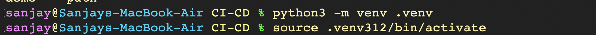
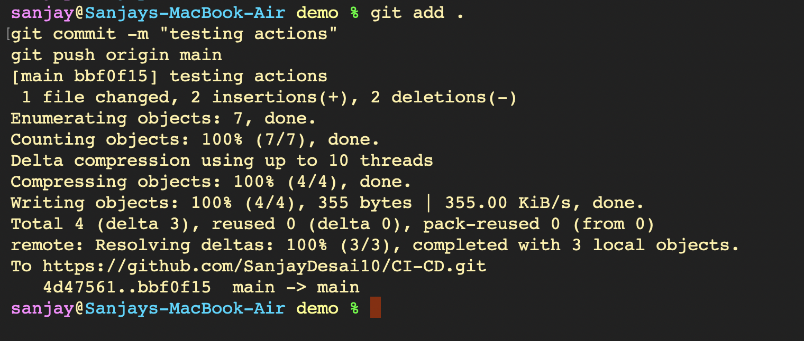

# DevSecOps Pipeline & Security Validation - Hands-on Lab

A comprehensive hands-on guide exploring DevSecOps lifecycle practices: establishing isolated Python virtual environments, deploying and testing the DevSecOps Hub microservice, enforcing automated quality gates and code coverage analysis via `pytest` and `pytest-cov`, performing command-line REST API contract validation, managing and cleaning Docker container lifecycles, triggering automated CI/CD security workflows via Git, and deploying containerized microservices to Kubernetes with Minikube service tunneling.

---

## Part 1: Local Python Environment & Web Microservice Setup

### 1. Initializing and Activating Python Virtual Environment
Create an isolated execution environment to manage project dependencies independently from system packages.
```bash
python3 -m venv .venv
source .venv312/bin/activate
```


### 2. Installing Web Application Dependencies
Install core runtime packages specified in `requirements.txt` including Flask, Jinja2, Werkzeug, Blinker, and Click.
```bash
pip install -r requirements.txt
```


### 3. Launching Flask Development Server
Run the Flask microservice locally on port 5001 with active debugging and real-time reloading.
```bash
python3 app/app.py
```


### 4. Verifying DevSecOps Hub Web Interface
Access the interactive DevSecOps Hub interface at `http://localhost:5001` to test the dashboard, health indicators, and API playground.


---

## Part 2: Automated Testing, Quality Gates & Coverage Analysis

### 1. Installing DevSecOps Testing Packages
Install automated testing and coverage frameworks specified in `requirements-dev.txt` (`pytest`, `pytest-cov`, and `iniconfig`).
```bash
pip install -r requirements-dev.txt
```


### 2. Executing Automated Test Suite & Measuring Code Coverage
Execute all 8 unit tests covering health checks, greetings, status reporting, and mathematical operations while generating line-by-line coverage analysis.
```bash
python3 -m pytest --cov=app --cov-report=term-missing
```


---

## Part 3: Live REST API Validation & Contract Verification

### 1. Verifying API Endpoints via `curl`
Execute command-line HTTP requests against application routes to validate response headers, status codes, and JSON serialization.
```bash
# Health check endpoint
curl http://localhost:5001/health

# Dynamic parameter greeting endpoint
curl http://localhost:5001/api/greet/Nensi

# Addition API with JSON payload
curl -X POST http://localhost:5001/api/add \
  -H "Content-Type: application/json" \
  -d '{"number1": 10, "number2": 20}'

# Dynamic arithmetic calculation API
curl -X POST http://localhost:5001/api/calculate \
  -H "Content-Type: application/json" \
  -d '{"a": 6.0, "b": 3.0, "operation": "multiply"}'
```


### 2. Verifying Dashboard Application Status
Verify browser UI updates reflecting recent API interactions, runtime health indicators, and uptime metrics.


---

## Part 4: Docker Container Management & Resource Cleanup

### 1. Inspecting and Stopping Active Docker Containers
Audit running Docker containers and gracefully stop active container workloads to free host system resources.
```bash
docker ps
docker stop 9f49fc72cbce
```


### 2. Purging Stopped Containers and Removing Local Images
Remove dangling container processes and untag local application images to ensure a pristine build state.
```bash
docker rm 3f87deffb22d 3acf7cd9009c
docker rmi hey-cicd:latest
```


---

## Part 5: Git Version Control & Pipeline Execution

### 1. Triggering Automated CI/CD Actions via Git Push
Stage configuration changes, commit testing modifications, and push to the remote repository on `main` to trigger the automated security pipeline.
```bash
git add .
git commit -m "testing actions"
git push origin main
```


---

## Part 6: Kubernetes Workload Deployment & Service Tunneling

### 1. Applying Workload Manifests & Verifying Cluster Resources
Apply Kubernetes Deployment and Service definitions, verifying pod transition to the `Running` state and inspecting NodePort port allocations.
```bash
kubectl apply -f k8s/service.yaml
kubectl apply -f k8s/deployment.yaml
kubectl get pods
kubectl get service session17-python
minikube service session17-python
```


### 2. Accessing In-Cluster Application via Minikube Tunnel
Open and interact with the Kubernetes-hosted application via the forwarded Minikube tunnel endpoint (`127.0.0.1:50058`).

