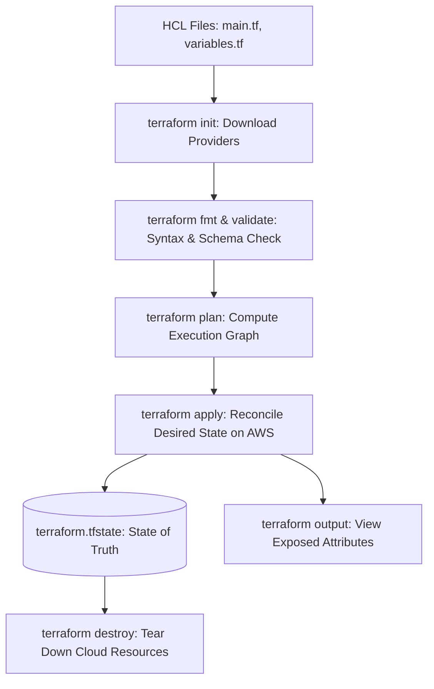
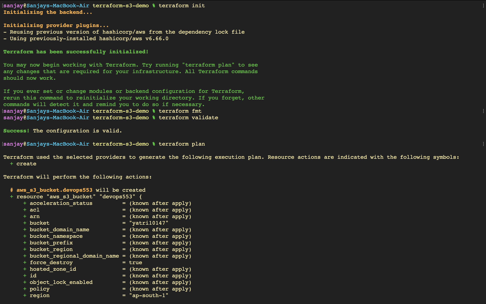
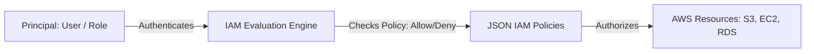
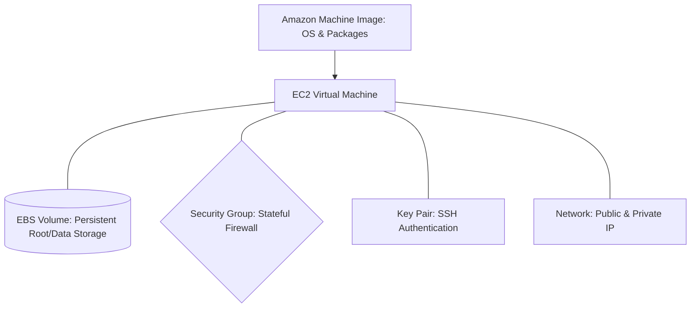
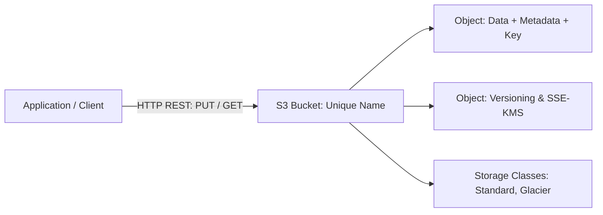
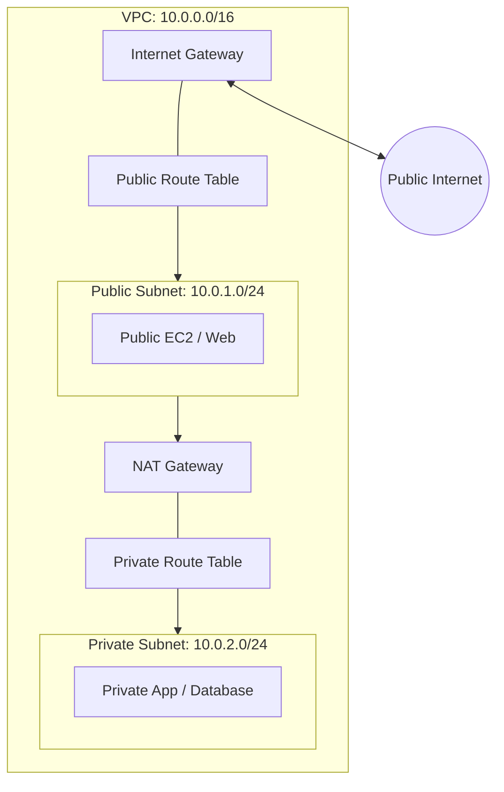
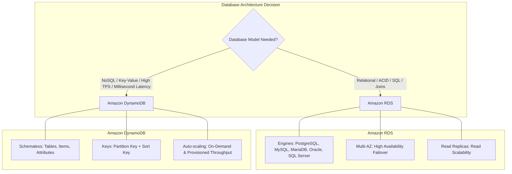

# Infrastructure as Code with Terraform & AWS Core Services - Hands-on Lab & Research Guide

A comprehensive guide exploring Infrastructure as Code (IaC) principles using HashiCorp Terraform: project anatomy, HCL syntax, provider configurations, the Terraform execution lifecycle (`init`, `fmt`, `validate`, `plan`, `apply`, `state`, `show`, `output`, `destroy`), provisioning AWS S3 buckets with tagging strategies, and an in-depth architectural analysis of core AWS cloud services: **IAM**, **EC2**, **S3**, **VPC**, **DynamoDB**, and **RDS**.

---

## Part 1: Terraform Architecture & IaC Fundamentals

### 1. What is Infrastructure as Code (IaC)?
Infrastructure as Code is the practice of managing and provisioning computer data centers and cloud resources through machine-readable definition files, rather than physical hardware configuration or interactive configuration tools.

### 2. Standard Terraform Project Structure
```text
terraform-s3-demo/
├── provider.tf        # Cloud provider definitions & version constraints
├── variables.tf       # Parameter declarations & validation rules
├── terraform.tfvars   # Concrete environment-specific input values
├── main.tf            # Declarative resource blocks
├── outputs.tf         # Values exposed for downstream consumption
└── README.md          # Project documentation
```

### 3. Terraform Lifecycle Flow



---

## Part 2: Hands-on Lab — Terraform AWS S3 Bucket Demo

### 1. Initializing Providers, Formatting HCL, and Validating Configuration
Initialize Terraform working directory with the AWS provider plugin (`hashicorp/aws v6.66.0`), format configuration files to canonical conventions, and validate syntax and schema rules.
```bash
terraform init
terraform fmt
terraform validate
```


### 2. Generating and Inspecting Execution Plan
Execute `terraform plan` to determine the actions necessary to achieve the desired infrastructure state without directly modifying cloud resources.
```bash
terraform plan
```
- **Target Resource**: `aws_s3_bucket.devops553`
- **Target Bucket**: `yatri10147`
- **Target Region**: `ap-south-1`
- **Force Destroy**: `true`

### 3. Applying Infrastructure Configuration with `terraform apply`
Apply the execution plan to provision the Amazon S3 bucket on AWS with standardized resource tags (`Environment`, `ManagedBy`, `Name`, `Project`).
```bash
terraform apply
```


### 4. Querying Managed Resources in State File
List all resources tracked within the Terraform state file using `terraform state list` to confirm state synchronization.
```bash
terraform state list
```


### 5. Deep Inspection of Resource Attributes via `state show`
Inspect all read-only and computed attributes of the provisioned bucket, including its Amazon Resource Name (ARN), regional endpoint, canonical user grants, and server-side encryption settings.
```bash
terraform state show aws_s3_bucket.devops553
```


### 6. Outputs, AWS CLI Verification & Teardown Planning
Extract key infrastructure attributes defined in `outputs.tf`, verify bucket creation via the AWS CLI (`aws s3 ls`), and generate a speculative destruction plan with `terraform plan -destroy`.
```bash
terraform output
aws s3 ls
terraform plan -destroy
```
```text
Outputs:
bucket_arn    = "arn:aws:s3:::yatri10147"
bucket_name   = "yatri10147"
bucket_region = "ap-south-1"
```


---

## Part 3: AWS Services Comprehensive Research Guide

---

### 01. AWS IAM (Identity and Access Management) — Governance & Security
**What is IAM?** AWS Identity and Access Management is a web service that enables you to securely control access to AWS services and resources. It provides centralized authentication and authorization across your entire cloud account.



- **Users**: Unique human identities representing people or standalone applications requiring long-term security credentials (console password, access keys).
- **Groups**: Collections of IAM users. Permissions applied to a group automatically propagate to all member users (e.g., `Developers`, `Admins`, `Auditors`).
- **Roles**: Identities with specific permissions that can be assumed by anyone who needs them, including AWS services (EC2 instances, Lambda functions) or federated external users (OAuth/SAML). Roles do not use static passwords or access keys; they issue short-lived temporary security credentials (STS).
- **Policies**: Declarative JSON documents that explicitly define permissions:
  ```json
  {
    "Version": "2012-10-17",
    "Statement": [{
      "Effect": "Allow",
      "Action": ["s3:GetObject", "s3:ListBucket"],
      "Resource": ["arn:aws:s3:::my-bucket", "arn:aws:s3:::my-bucket/*"]
    }]
  }
  ```
- **Principle of Least Privilege**: The security posture of granting only the absolute minimum set of permissions necessary to complete a task, minimizing the blast radius of compromised credentials.
- **IAM Best Practices**:
  - Lock down and secure the AWS Root account with multi-factor authentication (MFA); never use root for daily tasks.
  - Require MFA for all privileged IAM users.
  - Use IAM Roles instead of static long-term access keys for workloads and EC2 instances.
  - Rotate credentials regularly and audit unused credentials via IAM Credential Reports.
- **Common Use Cases**: Granting developer access to staging environments, enabling microservices on EKS/EC2 to securely query databases without hardcoded passwords.

---

### 02. AWS EC2 (Elastic Compute Cloud) — Virtual Compute
**What is EC2?** Amazon Elastic Compute Cloud provides scalable virtual server capacity in the AWS cloud, allowing rapid provisioning of compute instances without upfront hardware investments.



- **AMI (Amazon Machine Image)**: Pre-configured virtual appliance templates containing the operating system, server software, and base configurations (e.g., Ubuntu, Amazon Linux 2023, Red Hat).
- **Instance Types**: Families optimized for diverse workloads:
  - `t3`/`t4g`: Burstable general-purpose instances for development/microservices.
  - `m6i`/`m7g`: Balanced general-purpose compute/memory.
  - `c6i`/`c7g`: Compute-optimized for CPU-intensive tasks and batch processing.
  - `r6i`/`r7g`: Memory-optimized for in-memory databases and large-scale caching.
- **Key Pairs**: Cryptographic public-private key pairs used for secure SSH (Linux) or RDP (Windows) authentication into EC2 instances.
- **Security Groups**: Virtual stateful firewalls controlling inbound and outbound traffic at the network interface level.
- **EBS (Elastic Block Store)**: High-performance block-level storage volumes attached to EC2 instances, persisting independently of instance reboots or stops.
- **Public vs. Private IP**:
  - *Public IP*: Routable across the public internet, assigned dynamically or via static Elastic IP (EIP).
  - *Private IP*: Routable strictly within the VPC internal network, persistent throughout the instance lifecycle.
- **Instance Lifecycle**: `pending` → `running` → `stopping` → `stopped` → `shutting-down` → `terminated`.
- **Common Use Cases**: Hosting web servers, container worker nodes (Kubernetes/ECS), batch computing, and CI/CD self-hosted runners.

---

### 03. AWS S3 (Simple Storage Service) — Object Storage
**What is S3?** Amazon S3 is an object storage service offering 99.999999999% (11 9s) of durability, industry-leading scalability, data availability, security, and performance.



- **Buckets**: Top-level containers for data stored in S3. Bucket names must be globally unique across all AWS accounts worldwide.
- **Objects**: Fundamental entities stored in S3 consisting of object data (file content), a unique key (file path/name), and metadata (tags, content-type).
- **Storage Classes**:
  - *S3 Standard*: High-frequency access, low latency, high throughput.
  - *S3 Intelligent-Tiering*: Automatic cost savings by shifting objects between access tiers based on usage patterns.
  - *S3 Standard-IA (Infrequent Access)*: Lower storage cost for data accessed less frequently but requiring rapid retrieval.
  - *S3 Glacier Flexible / Deep Archive*: Extremely low-cost cold storage for long-term compliance archiving (minutes to hours retrieval).
- **Versioning**: Preserves multiple revisions of the same object in the same bucket, protecting against accidental overwrites and deletions.
- **Lifecycle Policies**: Automated rules that transition aging objects between storage classes (e.g., move to Glacier after 90 days) or permanently expire them.
- **Encryption**:
  - *SSE-S3*: Server-Side Encryption with Amazon S3-managed keys (AES-256).
  - *SSE-KMS*: Server-Side Encryption with AWS Key Management Service keys, providing audit logs of key access.
  - *SSE-C*: Server-Side Encryption with customer-provided keys.
- **Bucket Policies**: Resource-based JSON access control policies attached directly to the bucket to manage public access, SSL-only enforcement, or cross-account permissions.
- **Common Use Cases**: Static website hosting, Terraform state backend storage, application data lakes, backup and disaster recovery.

---

### 04. AWS VPC (Virtual Private Cloud) — Networking
**What is VPC?** Amazon VPC enables you to launch AWS resources into a logically isolated virtual network that you define, closely resembling a traditional network that you'd operate in your own data center.



- **CIDR (Classless Inter-Domain Routing)**: IP addressing methodology used to designate network IP ranges (e.g., `10.0.0.0/16` provides 65,536 private IP addresses).
- **Subnets**: Subdivisions of a VPC IP range tied to a specific Availability Zone (AZ).
  - *Public Subnet*: Associated with a route table containing a route to the Internet Gateway (`0.0.0.0/0 -> igw`).
  - *Private Subnet*: Isolated from direct inbound internet traffic, routed through a NAT Gateway for outbound connectivity only.
- **Internet Gateway (IGW)**: Horizontally scaled, redundant VPC component that enables communication between resources in your VPC and the public internet.
- **NAT Gateway**: Network Address Translation service located in a public subnet allowing instances in private subnets to reach the internet for updates while preventing unsolicited inbound connections.
- **Route Tables**: Sets of rules (routes) determining where network traffic from subnets or gateways is directed.
- **Security Groups vs. Network ACLs**:
  - *Security Group*: Stateful virtual firewall operating at the instance/ENI level (allowing inbound automatically allows corresponding outbound traffic).
  - *Network ACL (NACL)*: Stateless security layer operating at the subnet boundary with explicit numbered allow and deny rules.
- **Common Use Cases**: Multi-tier web applications (public web tier, private application tier, private database tier), hybrid cloud interconnects via VPN/Direct Connect.

---

### 05. AWS Database Services: DynamoDB & RDS



#### A. Amazon DynamoDB (NoSQL)
- **Overview**: Fully managed, serverless, key-value and document database delivering single-digit millisecond latency at any scale.
- **Tables, Items, and Attributes**:
  - *Table*: A collection of data items.
  - *Item*: A collection of attributes, uniquely identifiable among all other items (similar to a row).
  - *Attribute*: A fundamental data element requiring no uniform schema across items (similar to a column).
- **Primary Keys**:
  - *Partition Key (Simple Primary Key)*: A hash key determining internal storage partition distribution.
  - *Sort Key (Composite Primary Key)*: Combined with partition key to store items with the same partition key physically close together in sorted order.
- **Key Features**: Global Secondary Indexes (GSI), Local Secondary Indexes (LSI), DynamoDB Streams, continuous automated backups with Point-In-Time Recovery (PITR).
- **Common Use Cases**: User session storage, gaming leaderboards, shopping carts, high-throughput IoT telemetry.

#### B. Amazon RDS (Relational Database Service)
- **Overview**: Managed relational database service that simplifies provisioning, operating, and scaling SQL databases in the cloud.
- **Supported Engines**: PostgreSQL, MySQL, MariaDB, Oracle Database, Microsoft SQL Server, and cloud-native Amazon Aurora.
- **Key Architectural Features**:
  - *Multi-AZ Deployment*: Synchronously replicates data across different Availability Zones for automated failover during outages with zero manual intervention.
  - *Read Replicas*: Asynchronously replicates updates to separate read-only database instances to scale read-heavy application traffic.
  - *Automated Backups & Snapshots*: Daily storage volume snapshots and transaction log retention allowing point-in-time recovery to the second.
  - *Security*: Network isolation inside private subnets, encryption at rest using AWS KMS, and encryption in transit via SSL/TLS.
- **Common Use Cases**: E-commerce platforms, transactional SaaS databases, ERP systems, CRM applications requiring ACID transactions and complex SQL joins.
