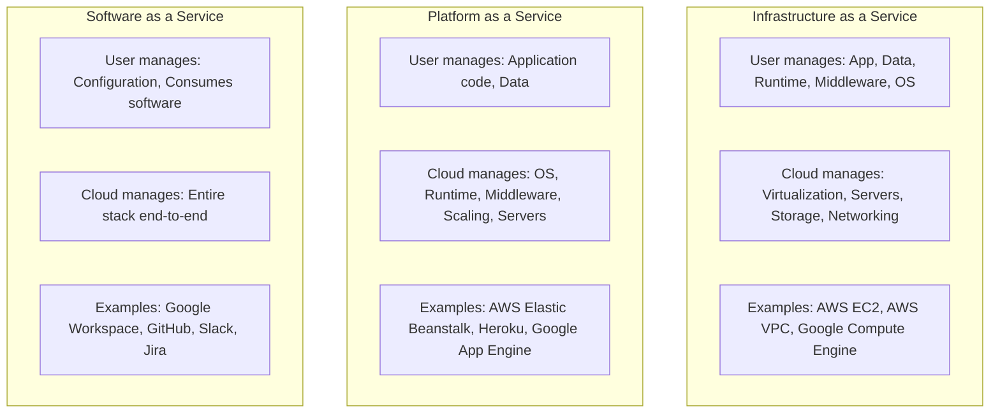
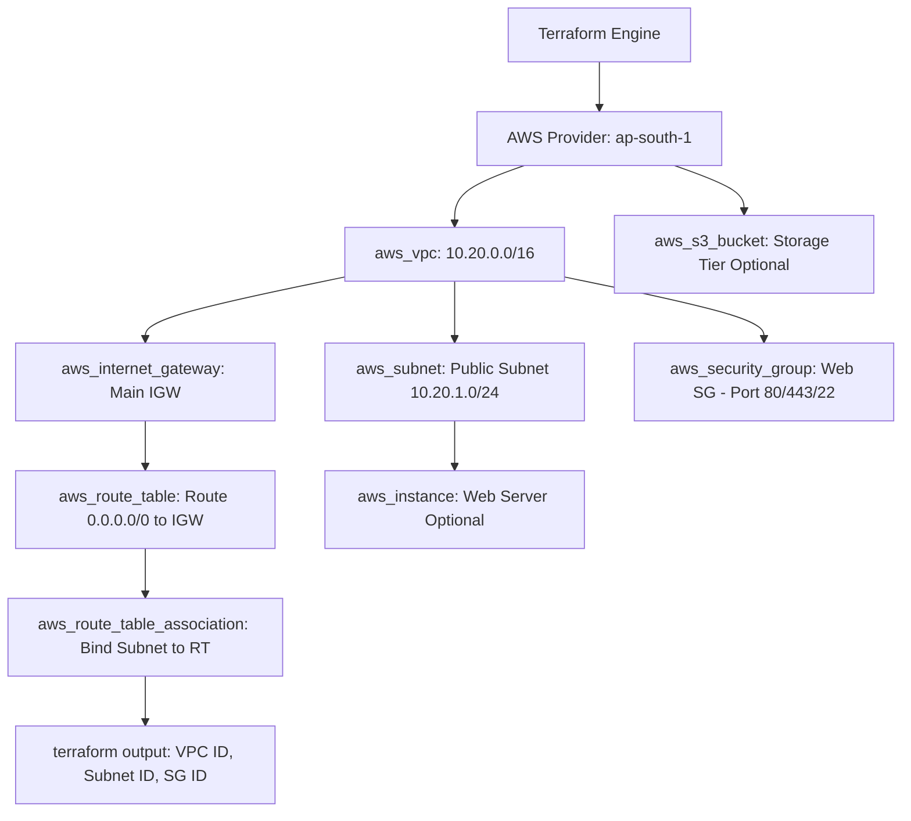

# Cloud Infrastructure in Action with Terraform & AWS - Hands-on Lab & Architecture Guide

A comprehensive guide demonstrating automated cloud infrastructure provisioning using HashiCorp Terraform on Amazon Web Services (AWS): cloud service models (IaaS, PaaS, SaaS), regional architecture and availability zones, core Terraform concepts (providers, variables, resource graph dependencies, state management, outputs), and an end-to-end hands-on lab deploying a complete VPC network architecture with public subnets, Internet Gateways, route tables, security groups, and cloud teardown.

---

## Part 1: Cloud Architecture Foundations

### 1. Cloud Service Models: IaaS vs PaaS vs SaaS



### 2. AWS Regions and Availability Zones (AZs)
- **AWS Region**: A separate geographic area in the world (e.g., `ap-south-1` in Mumbai, `us-east-1` in N. Virginia) containing multiple isolated data centers.
- **Availability Zone (AZ)**: One or more discrete data centers with redundant power, networking, and connectivity within an AWS Region (e.g., `ap-south-1a`, `ap-south-1b`).
- **High Availability & Fault Tolerance**: Architecting across multiple AZs ensures that even if a catastrophic failure takes an entire data center offline, workloads in neighboring AZs continue uninterrupted.

---

## Part 2: End-to-End Terraform Architecture



---

## Part 3: Core Terraform Engineering Primitives

1. **Providers**: Plugins that bridge Terraform with cloud APIs (`hashicorp/aws`). They handle authentication, API request marshaling, and resource CRUD operations.
2. **Variables**: Dynamic configuration parameters that make infrastructure reusable across environments (`dev`, `staging`, `prod`):
   - Input Variables (`variables.tf` and `terraform.tfvars`)
   - Local Values (`locals {}`) for computed expressions
3. **Resources**: Core building blocks representing cloud objects (`aws_vpc`, `aws_subnet`, `aws_security_group`).
4. **Dependencies & Resource Graph**:
   - **Implicit Dependencies**: Automatically inferred when one resource references an attribute of another (e.g., `vpc_id = aws_vpc.main.id`). Terraform builds a directed acyclic graph (DAG) to determine optimal parallel creation order.
   - **Explicit Dependencies**: Manually configured using `depends_on = [aws_internet_gateway.main]` when relationships cannot be inferred from attributes.
5. **Outputs**: Structured values returned after provisioning (`outputs.tf`) used by CI/CD pipelines, configuration scripts, or separate Terraform stacks.
6. **Terraform State (`terraform.tfstate`)**:
   - Maps declared HCL configuration to real-world cloud resources.
   - Stores resource metadata, attributes, and dependency mappings.
   - Remote backends (AWS S3 + DynamoDB locking) prevent state corruption and allow concurrent team collaboration.

---

## Part 4: Hands-on Lab — Cloud Infrastructure Provisioning

### 1. Initializing Backend Plugins and Validating Configuration
Initialize the Terraform working directory using the AWS provider (`hashicorp/aws v6.68.0`), apply standard style formatting with `terraform fmt`, and ensure semantic correctness using `terraform validate`.
```bash
terraform init
terraform fmt
terraform validate
```


### 2. Execution Planning for Cloud Network Architecture
Execute `terraform plan` to compute the dependency graph and calculate the exact set of resources to create:
- **Virtual Private Cloud (VPC)**: `10.20.0.0/16` CIDR block
- **Internet Gateway (IGW)**: `session19-mini-igw` attached to VPC
- **Public Subnet**: `10.20.1.0/24` CIDR in availability zone
- **Public Route Table**: `session19-mini-public-rt` routing `0.0.0.0/0` via IGW
- **Route Table Association**: Associating public subnet with public route table
- **Security Group**: `session19-mini-web-sg` for inbound web traffic
```bash
terraform plan
```


### 3. Provisioning AWS Networking Resources with `terraform apply`
Apply the planned changes to create all networking components in the `ap-south-1` region, attaching tags (`ManagedBy = "Terraform"`, `Session = "19"`, `Name`).
```bash
terraform apply
```


### 4. Querying Provisioned Resource Outputs
Inspect the structured output values exposed by `outputs.tf` for consumption by application instances or downstream services.
```bash
terraform output
terraform state list
```
```text
Outputs:
security_group_id = "sg-0299c28910bcf2839"
subnet_id         = "subnet-0691a941761c9c670"
vpc_cidr          = "10.20.0.0/16"
vpc_id            = "vpc-0e7a10ee2b0b8262b"

State Resources:
aws_internet_gateway.main
aws_route_table.public
aws_route_table_association.public
aws_security_group.web
aws_subnet.public
aws_vpc.main
```


### 5. Infrastructure Destruction & Clean Teardown
Preview and execute the destruction workflow using `terraform plan -destroy` and `terraform destroy` to ensure zero leftover cloud resource costs or orphaned network dependencies.
```bash
terraform plan -destroy
terraform destroy
```

