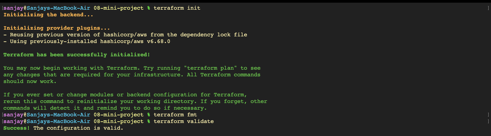

# AWS VPC Networking with Terraform - Hands-on Lab

A comprehensive hands-on guide demonstrating the automated provisioning of cloud networking architecture using HashiCorp Terraform on Amazon Web Services (AWS): initializing provider plugins, linting and validating configuration code, planning and creating an isolated Amazon Virtual Private Cloud (VPC), attaching an Internet Gateway (IGW), configuring public subnets, defining routing tables with default routes (`0.0.0.0/0`), provisioning web security groups, querying structured Terraform outputs, inspecting state resources, and performing graceful infrastructure teardown.

---

## Part 1: Terraform Initialization & Code Validation

### 1. Initializing Backend Plugins and Validating HCL Configuration
Initialize the Terraform working directory using the AWS provider (`hashicorp/aws v6.68.0`), apply standard style formatting with `terraform fmt`, and ensure semantic correctness using `terraform validate`.
```bash
terraform init
terraform fmt
terraform validate
```


---

## Part 2: Execution Planning for Cloud Network Architecture

### 1. Generating Execution Plan for VPC & Network Components
Execute `terraform plan` to calculate the exact set of resources to create:
- **Virtual Private Cloud (VPC)**: `10.20.0.0/16` CIDR block
- **Internet Gateway (IGW)**: `session19-mini-igw` attached to VPC
- **Public Subnet**: `10.20.1.0/24` CIDR in availability zone
- **Public Route Table**: `session19-mini-public-rt` routing `0.0.0.0/0` via IGW
- **Route Table Association**: Associating public subnet with public route table
- **Security Group**: `session19-mini-web-sg` for inbound web traffic
```bash
terraform plan
```


---

## Part 3: Applying Infrastructure Configuration

### 1. Provisioning AWS Networking Resources with `terraform apply`
Apply the planned changes to create all networking components in the `ap-south-1` region, attaching tags (`ManagedBy = "Terraform"`, `Session = "19"`, `Name`).
```bash
terraform apply
```


---

## Part 4: Output Variables & State Inspection

### 1. Querying Provisioned Resource Outputs
Inspect the structured output values exposed by `outputs.tf` for consumption by application instances or downstream services.
```bash
terraform output
```
```text
security_group_id = "sg-0299c28910bcf2839"
subnet_id         = "subnet-0691a941761c9c670"
vpc_cidr          = "10.20.0.0/16"
vpc_id            = "vpc-0e7a10ee2b0b8262b"
```

### 2. Auditing Managed Resources in State File
List all resources tracked within the Terraform state file to verify complete state registration across all networking primitives.
```bash
terraform state list
```
```text
aws_internet_gateway.main
aws_route_table.public
aws_route_table_association.public
aws_security_group.web
aws_subnet.public
aws_vpc.main
```


---

## Part 5: Infrastructure Destruction & Resource Cleanup

### 1. Planning and Executing Complete Teardown
Preview and execute the destruction workflow using `terraform plan -destroy` and `terraform destroy` to ensure zero leftover cloud resource costs or orphaned network dependencies.
```bash
terraform plan -destroy
terraform destroy
```

