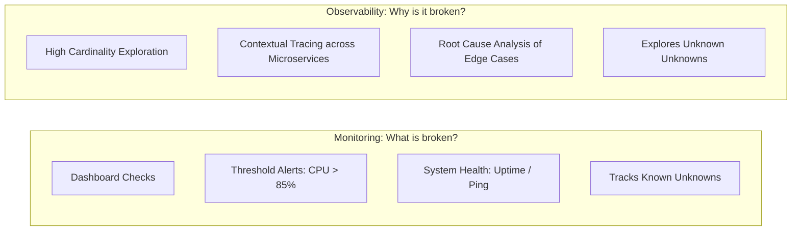
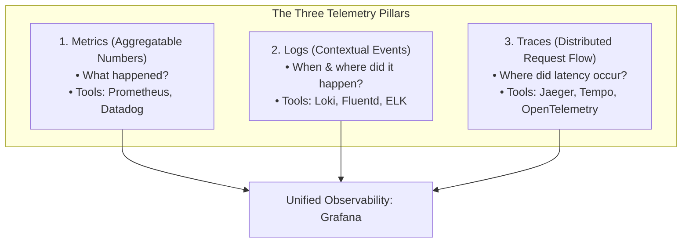
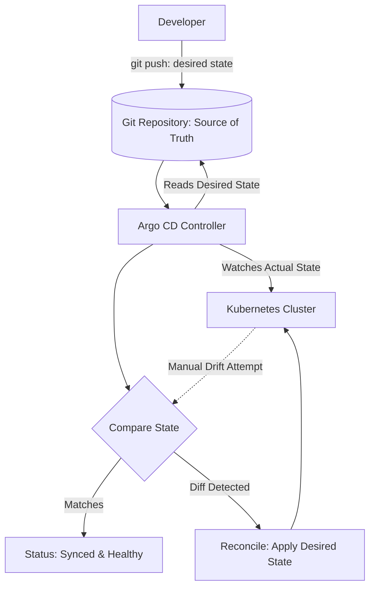
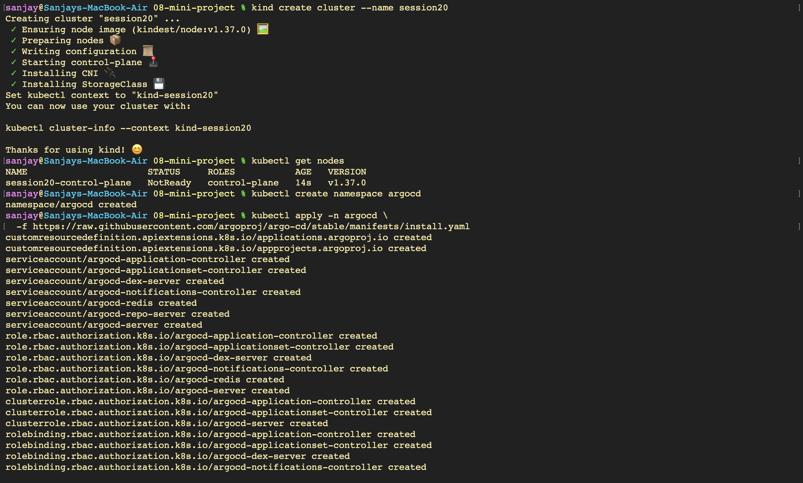

# Monitoring, Observability & GitOps with Argo CD - Hands-on Lab & Comprehensive Guide

A comprehensive guide exploring enterprise observability and continuous delivery: the difference between monitoring and observability, the three pillars of telemetry (**Metrics**, **Logs**, **Traces**), Kubernetes observability architectures (Prometheus, Grafana, Alertmanager), core GitOps principles (Git as the single source of truth, declarative state, and continuous reconciliation), and a hands-on lab using `kind` and **Argo CD** demonstrating automated synchronization, git-driven auto-scaling, drift detection, and self-healing.

---

## Part 1: Monitoring vs. Observability



### 1. Monitoring: System Telemetry & Alerting
- **Definition**: The operational practice of collecting, aggregating, and analyzing quantitative metrics to determine if a system is operating within healthy performance thresholds.
- **Metrics**: Numerical time-series measurements (counters, gauges, histograms) representing state (e.g., CPU %, Memory GB, Request Latency ms).
- **Logs**: Discrete timestamped event records emitted by applications detailing operational occurrences and stack traces.
- **Alerts**: Automated notifications triggered when metrics breach defined service level indicators (SLIs), dispatching alerts to engineers via PagerDuty, Slack, or email.
- **Application Health**: Liveness and readiness probes verifying whether processes are running and able to handle incoming traffic.

### 2. Observability: Understanding Internal State from External Outputs
- **Definition**: A measure of how well the internal states of a distributed system can be inferred solely based on knowledge of its external outputs (telemetry).
- **Why is Observability Required?**
  In modern distributed microservice and Kubernetes environments, failures are rarely binary (up or down). Applications experience partial degradation, network jitter, database connection pool starvation, and cascading timeouts. Observability enables engineers to debug complex, unexpected behaviors without deploying new debugging code.

---

## Part 2: The Three Pillars of Observability



| Telemetry Pillar | Data Type | Characteristics | Key Benefits | Common Open-Source Tools |
| :--- | :--- | :--- | :--- | :--- |
| **Metrics** | Numerical time-series data | Low overhead, highly compressible, real-time aggregations | Rapid trend detection, capacity planning, auto-scaling triggers | Prometheus, Grafana, Thanos, Cortex |
| **Logs** | Structured text/JSON event records | Rich semantic context, high volume, requires indexing | Forensic root-cause analysis, debugging exceptions | Grafana Loki, Fluentd, Logstash, Vector |
| **Traces** | Distributed spans with trace IDs | Tracks request lifecycle across microservice boundaries | Pinpointing latency bottlenecks, bottleneck service isolation | OpenTelemetry, Jaeger, Grafana Tempo |

### Kubernetes Observability Architecture
- **Node Level**: cAdvisor (embedded in Kubelet) collects resource utilization for all running containers.
- **Cluster Level**: `metrics-server` aggregates CPU/memory for HPA; `kube-state-metrics` exposes Kubernetes object health (pod restarts, pending PVCs).
- **Application Level**: Applications expose Prometheus endpoints (`/metrics`) scraped by Prometheus Operator via `ServiceMonitor` CRDs.

---

## Part 3: GitOps Principles & Reconciliation Loop

### 1. What is GitOps?
GitOps is an operational framework that takes DevOps best practices used for application development (version control, collaboration, compliance, and CI/CD) and applies them to infrastructure and application deployment automation.



### 2. Core GitOps Tenets
1. **The System is Described Declaratively**: The entire desired state of the cluster (deployments, networking, configurations) is defined declaratively in version control.
2. **Git is the Single Source of Truth**: Changes are made via pull requests to Git, ensuring full auditability, rollback capability, and peer review.
3. **Approved Changes are Automatically Applied**: Automated software agents pull approved changes directly from Git into the cluster.
4. **Continuous State Reconciliation & Self-Healing**: Software agents continuously observe the actual running state in the cluster against the desired state in Git, actively remediating any divergence or configuration drift.

---

## Part 4: Hands-on Lab — Kind, Argo CD & Automated Delivery

### 1. Provisioning Kind Cluster & Deploying Argo CD
Spin up a local Kubernetes cluster named `session20`, verify control-plane node readiness, create the `argocd` namespace, and apply the official Argo CD installation manifests.
```bash
kind create cluster --name session20
kubectl get nodes
kubectl create namespace argocd
kubectl apply -n argocd \
  -f https://raw.githubusercontent.com/argoproj/argo-cd/stable/manifests/install.yaml
```


### 2. Cloning the GitOps Source Repository
Clone the dedicated Git repository (`Git-Ops`) containing application deployment, service, and namespace declarations to serve as the immutable source of truth.
```bash
git clone https://github.com/SanjayDesai10/Git-Ops.git
```


### 3. Deploying Argo CD Application Custom Resource
Apply the `argocd-application.yaml` manifest specifying the target repository URL, destination namespace (`session20`), and automated sync policy. Verify the application reaches `Synced` and `Healthy` status.
```bash
kubectl apply -f app/argocd-application.yaml
kubectl get applications -n argocd
```


### 4. Inspecting Workloads in Destination Namespace
Inspect all resources automatically provisioned by Argo CD within the `session20` namespace, verifying running pods, service, deployment, and replica sets.
```bash
kubectl get all -n session20
```


---

## Part 5: Git-Driven Delivery & Self-Healing Reconciliation

### 1. Modifying Desired State in Git Repository
Update the deployment replica count (`replicas: 3`) in `app/deployment.yaml`, commit the change, and push to GitHub remote repository on `main`.
```bash
git add .
git status
git commit -m "updated replicas"
git push origin main
```


### 2. Observing Real-Time Automatic Scaling in Kubernetes
Watch the Kubernetes deployment controller dynamically scale up pods from 2 to 3 replicas as Argo CD detects the commit drift and reconciles the cluster to the new Git state.
```bash
kubectl get deployment -n session20 -w
```


### 3. Simulating Manual Configuration Drift
Manually scale the deployment down to 1 replica using `kubectl scale` to introduce configuration drift between the cluster and Git.
```bash
kubectl scale deployment session20-mini \
  -n session20 \
  --replicas=1
kubectl get deployment -n session20
```


### 4. Verifying Automated Self-Healing and State Reconciliation
Observe Argo CD's reconciliation loop detect that the cluster state diverged from Git. Argo CD automatically overrides the manual change, restoring the cluster back to 3 healthy running pods.
```bash
kubectl logs deployment/session20-mini -n session20
kubectl get pods -n session20
kubectl get application session20-mini -n argocd
```

