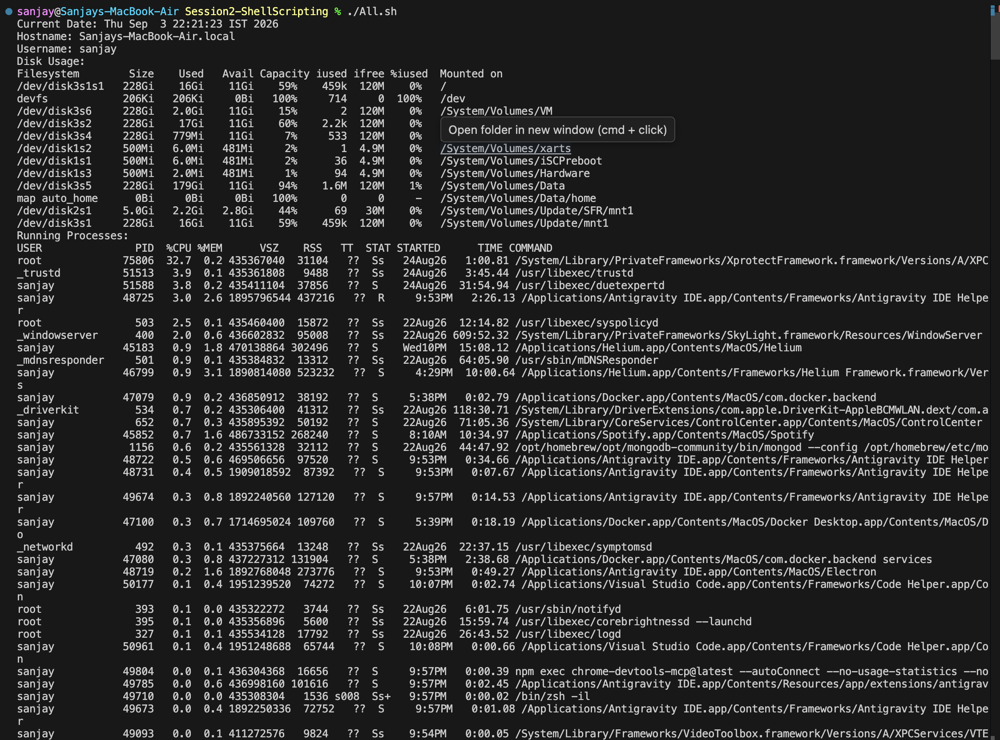

# Session 2 - Shell Scripting Assignment

## Task: System Information Script

A shell script that displays system telemetry, accepts user input, and redirects process information into a file.

### Script (`All.sh`)

```bash
#!/bin/bash

# 1. Storing system info in variables
current_date=$(date)
host_name=$(hostname)
user_name=$(whoami)

# 2. Displaying system information
echo "Current Date: $current_date"
echo "Hostname: $host_name"
echo "Username: $user_name"

echo "Disk Usage:"
df -h

echo "Running Processes:"
ps aux

# 3. Taking input from user using read -p
read -p "Enter directory name: " dir_name
read -p "Enter file name: " file_name

# 4. Creating directory and file
mkdir -p "$dir_name"
touch "$dir_name/$file_name"

# 5. Storing running processes in file using > redirection
ps aux > "$dir_name/$file_name"

echo "Process info saved to $dir_name/$file_name"
```

---

### Commands Used
- `date`: Prints current date.
- `hostname`: Prints system hostname.
- `whoami`: Prints current username.
- `echo`: Outputs text to console.
- `df`: Shows disk usage.
- `ps`: Shows running processes.
- `read -p`: Captures user input.
- `mkdir`: Creates the target directory.
- `touch`: Creates the target file.
- `>`: Redirects process output into the file.

---

### Output Screenshots

#### Terminal Execution



