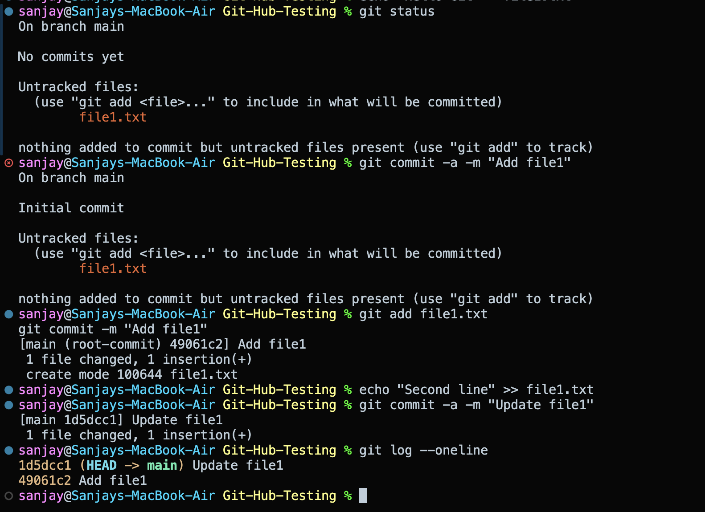

# Git & GitHub Homework

---

## Task 1: `git commit -a -m` vs `git commit -m`

### Key Differences

| Command | Behavior |
| :--- | :--- |
| `git commit -m "message"` | Commits only **staged** changes (`git add`). |
| `git commit -a -m "message"` | Auto-stages and commits **all modified tracked files**. Ignores untracked files. |

### Commands & Practice

```bash
# 1. Commit only staged files
git add file1.txt
git commit -m "Commit staged files"

# 2. Automatically stage tracked changes and commit
git commit -a -m "Auto stage and commit tracked changes"
```

---

## Task 2: Git Cherry-Pick

Apply a specific commit from one branch to another without merging the whole branch.

### Workflow

```bash
# 1. Check commit log on feature branch
git log --oneline

# 2. Switch to main branch
git checkout main

# 3. Cherry-pick the target commit
git cherry-pick <commit-hash>

# 4. Verify in main branch
git log --oneline -n 3
```

---

## Output Screenshots

### Task 1: Staging & Commit Workflow



---

### Task 2: Branch Commits & Cherry-Pick


