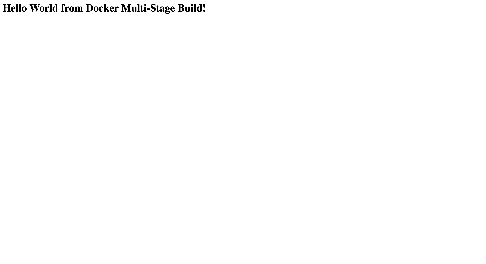
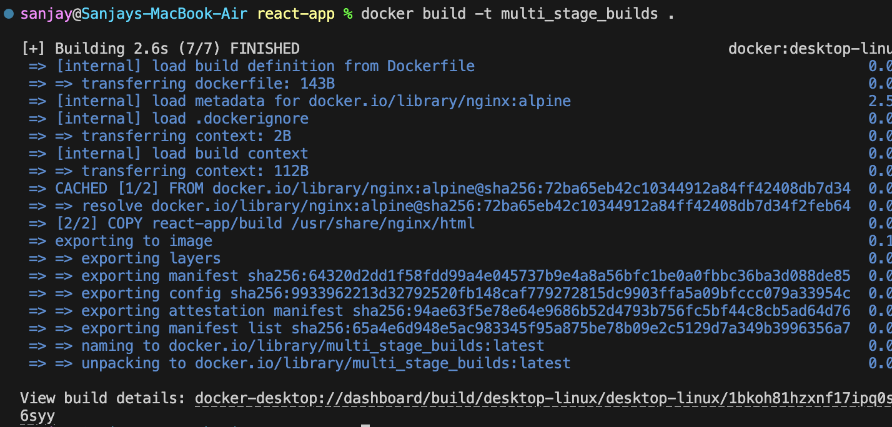
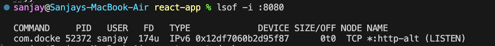
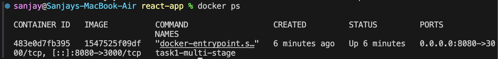
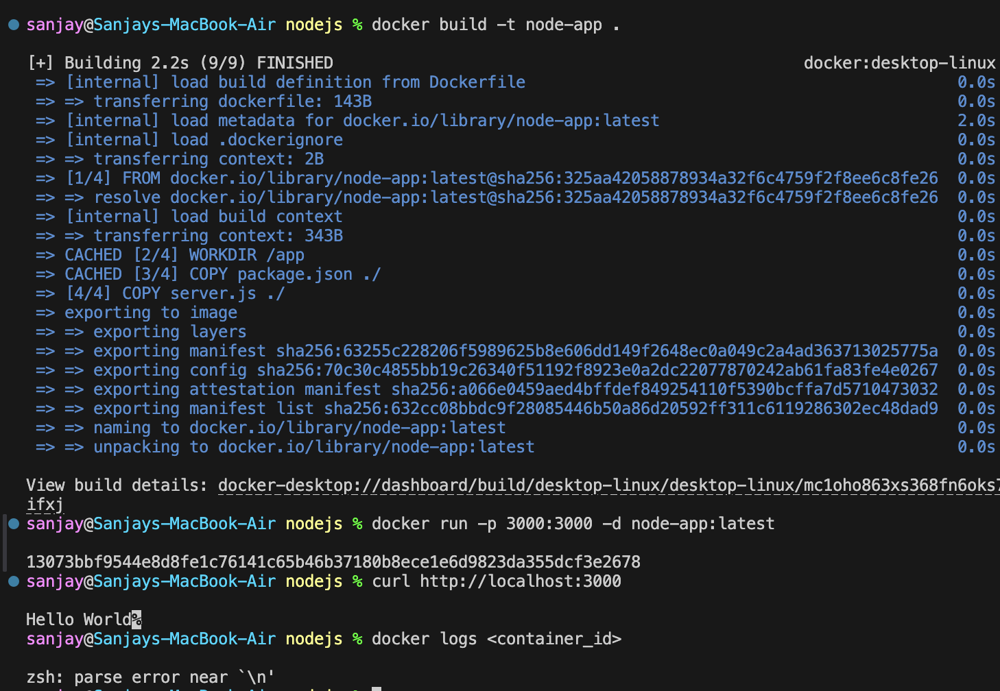
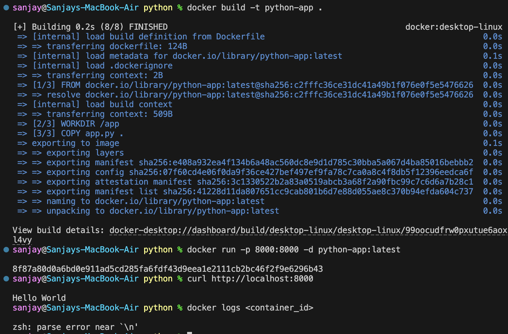
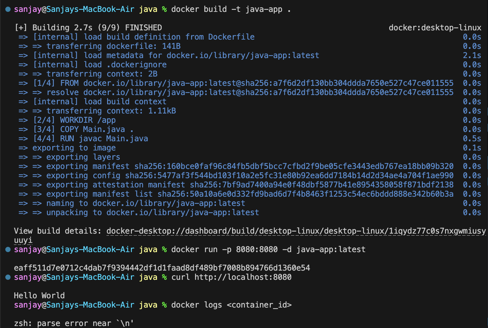

# Docker Multi-Stage Build & Multi-App Deployment

A practical assignment demonstrating multi-stage Docker builds to create lightweight container images, along with containerizing and deploying three distinct application runtimes (Node.js, Python, and Java).

---

## Task 1: Multi-Stage Dockerfile

Multi-stage builds help keep production images minimal by separating build dependencies from runtime assets. Here, a Node.js application is built in an initial stage, and only the required runtime files are carried over to the final production image.

### 1. Building the Image

Build the multi-stage image from the root directory:

```bash
docker build -t multi_stage_builds .
```



### 2. Running the Container

Run the container in detached mode, exposing the internal port `3000` to host port `8080`:

```bash
docker run -p 8080:3000 -d multi_stage_builds
```

### 3. Application Verification

Testing the running container via browser or curl:

```bash
curl http://localhost:8080
```

Response:
```html
<h1>Hello World from Docker Multi-Stage Build!</h1>
```



### 4. Container & Port Verification

Checking active containers and port binding status:

```bash
docker ps
```

The output confirms port `8080` forwarding to container port `3000` (`0.0.0.0:8080->3000/tcp`):



Verifying the active listening process:

```bash
lsof -i :8080
```



---

## Task 2: Documentation & Observations

- **Multi-Stage Efficiency:** Isolating dependencies in the builder stage keeps the final runtime clean and compact.
- **Port Mapping:** Clear separation between host ports and internal container ports makes services easily configurable.
- **Verification:** All stages, build processes, and active network ports have been validated with CLI outputs and screenshots.

---

## Task 3: Application Deployments (Node.js, Python, Java)

Three distinct application environments were containerized and verified:

| Application | Image Name | Container Port | Host Port | Verification Method |
| :--- | :--- | :---: | :---: | :--- |
| **Node.js** | `node-app` | `3000` | `3000` | `curl http://localhost:3000` |
| **Python** | `python-app` | `8000` | `8000` | `curl http://localhost:8000` |
| **Java** | `java-app` | `8080` | `8080` | `curl http://localhost:8080` |

### 1. Node.js Deployment Evidence

Building, running on port 3000, and testing the endpoint:



### 2. Python Deployment Evidence

Building, running on port 8000, and testing the endpoint:



### 3. Java Deployment Evidence

Compiling and running the Java HTTP server inside container on port 8080:


