# Docker Networking & Volume Homework Tasks

A comprehensive walkthrough demonstrating custom bridge networks, multi-network container communication, host networking, volume bind mounts, and overlay networking principles.

---

## Task 1: Docker Container Networking

This task demonstrates Docker container networking with a frontend container, backend container, and database container connected through custom isolated Docker networks.

### 1. Create Docker Networks

Create three isolated Docker bridge networks:

```bash
docker network create frontend-net
docker network create backend-net
docker network create database-net
```

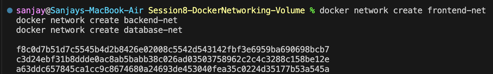

### 2. Build and Run Frontend Container

Build the frontend Nginx image and run it on `frontend-net`:

```bash
docker build -t frontend-image ./frontend
docker run -d --name frontend --network frontend-net -p 8081:80 frontend-image
```

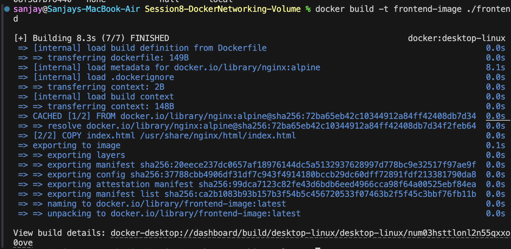
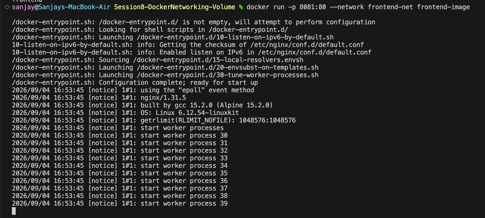

### 3. Build and Run Backend Container

Build the backend Python service and connect it initially to `frontend-net`:

```bash
docker build -t backend-image ./backend
docker run -d --name backend --network frontend-net -p 5000:5000 backend-image
```

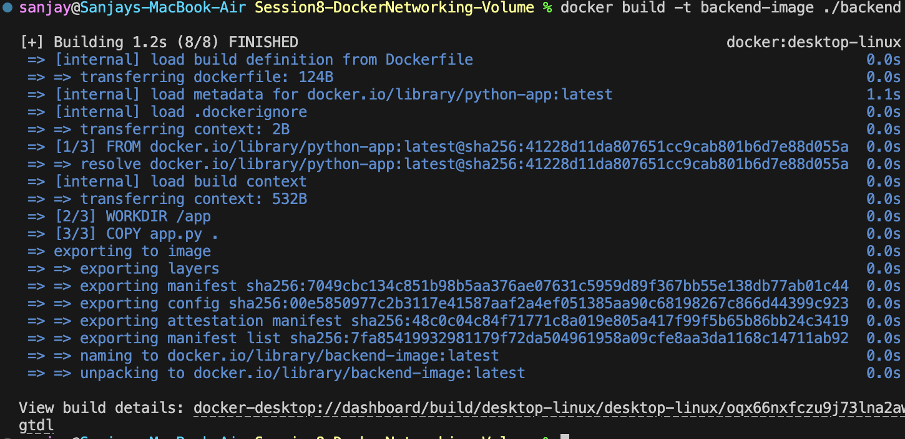
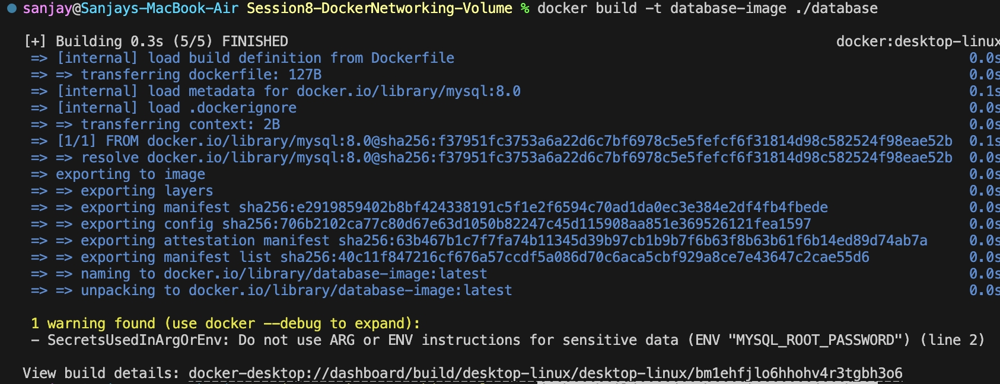

### 4. Build and Run Database Container

Build the MySQL database image and run it on `database-net`:

```bash
docker build -t database-image ./database
docker run -d --name database --network database-net database-image
```

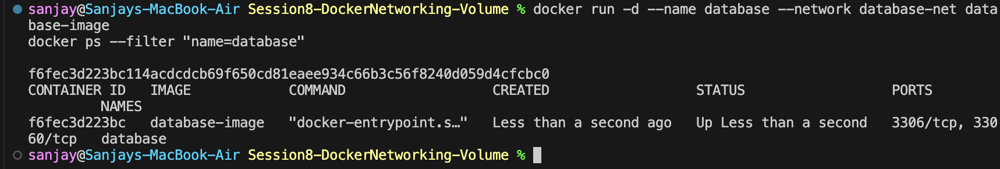
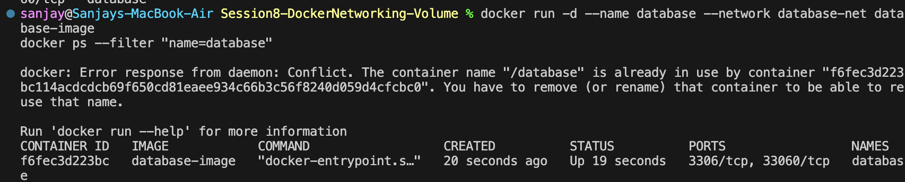

### 5. Connect Backend to Multiple Networks

Attach the `backend` container to both `backend-net` and `database-net`, allowing it to communicate with both the frontend and database layers:

```bash
docker network connect backend-net backend
docker network connect database-net backend
```

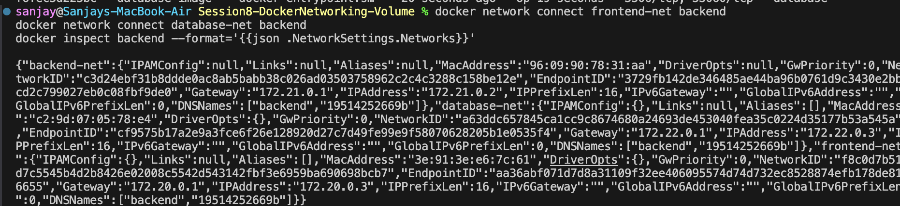

### 6. Verify Inter-Container Connectivity

Verify network connectivity from within the `backend` container to both `frontend` and `database`:

```bash
docker exec -it backend python -c "import urllib.request; print(urllib.request.urlopen('http://frontend').read().decode())"
docker exec -it backend ping -c 2 database
```

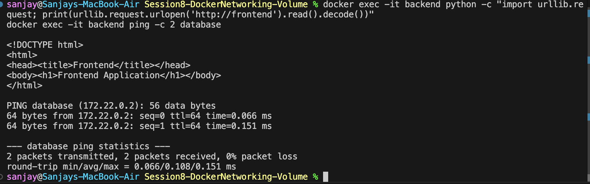

---

## Task 2: Host Network

Host networking allows a container to share the host machine’s network stack directly without Docker NAT or port forwarding.

### 1. Pull and Run Apache on Host Network

```bash
docker run -d --name apache-host --network host httpd:2.4-alpine
curl http://localhost:80
```

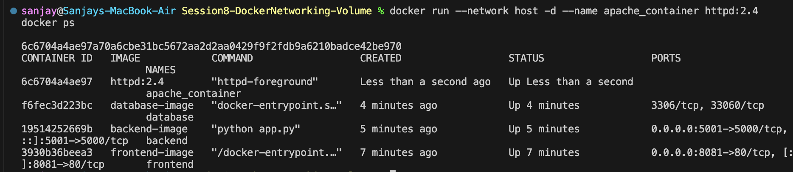

---

## Task 3: Bind Mount

Bind mounts map a directory from the host file system directly into a container, allowing live updates without rebuilding or restarting the container.

### 1. Start NGINX with Bind Mount

Mount the local `./bind-mount` folder to Nginx's HTML web directory:

```bash
docker run -d --name nginx-bind -p 8085:80 -v $(pwd)/bind-mount:/usr/share/nginx/html nginx:alpine
```

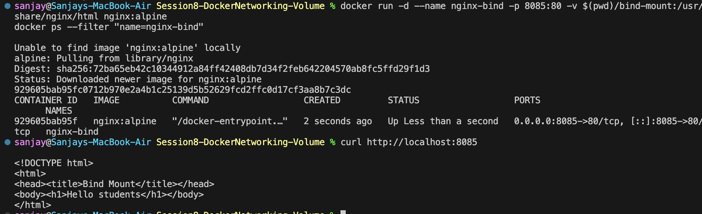

### 2. Access the Initial Web Page

```bash
curl http://localhost:8085
```

Output: `Hello students`


### 3. Verify Live Changes Without Container Restart

Update `index.html` on the host and verify the live update immediately:

```bash
curl http://localhost:8085
```


---

## Task 4: Overlay Network

Docker overlay networks are used when containers need to communicate across multiple Docker hosts in a swarm or multi-host environment. Unlike bridge networks, which work only on a single host, overlay networks create a virtual network that spans several machines.

### Use Cases

- **Multi-Host Container Communication:** Seamless communication between containers deployed across separate physical or cloud hosts.
- **Docker Swarm Deployments:** Native networking for multi-node Swarm services and cluster workloads.
- **Service Discovery:** Automatic DNS-based service discovery across distributed nodes without exposing ports to the external internet.
- **Microservices Architecture:** Scalable, decoupled backend and database services distributed across multiple worker nodes.

### How Overlay Networks Work

Overlay networks build a virtual software-defined network layer on top of the existing physical/host networks (underlay). 

1. **Packet Encapsulation (VXLAN):** Docker encapsulates Layer 2 container network packets inside standard Layer 4 UDP packets (port 4789) to route them between host machines.
2. **Control Plane Management:** Swarm manager nodes maintain and synchronize the network topology and IP address allocations using an encrypted control-plane gossip protocol.
3. **Transparent Delivery:** When a container sends traffic to another container on a different host, Docker handles routing, encapsulation, and decapsulation under the hood, making the communication appear as if both containers are attached to the same local switch.

### Key Points

- **Multi-Host Scope:** Specifically designed for cross-host networking, unlike single-host `bridge` networks.
- **Automatic Routing Mesh:** Incoming requests to published ports can be automatically routed to active service replicas on any node in the cluster.
- **Encrypted Data Plane:** Supports native IPsec traffic encryption between nodes with the `--opt encrypted` flag for sensitive production environments.

### Example Architecture Concept

In a microservices setup where a `frontend` service runs on **Host A** and a `backend` service runs on **Host B**, attaching both services to an overlay network (`docker network create -d overlay my-overlay`) allows the frontend to reach the backend simply using `http://backend:5000`, completely abstracting away host IP addresses and physical infrastructure.

### Summary

Overlay networks form the backbone of multi-host container networking, enabling distributed, fault-tolerant, and secure service communication across clustered environments.
