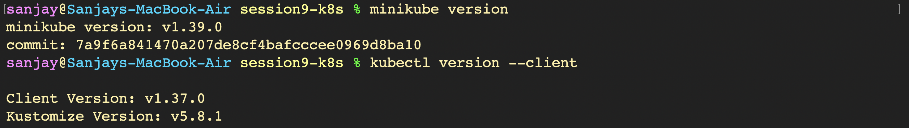

# Kubernetes Setup & Architecture - Hands-on Lab

---

## Task 1: Minikube Installation & Environment Setup

### 1. Verifying Minikube and Kubectl Installation

---

## Task 2: Minikube Cluster Lifecycle Execution

### 1. Starting the Minikube Cluster

### 2. Verifying Cluster Status & Node Readiness

### 3. Stopping the Minikube Cluster

